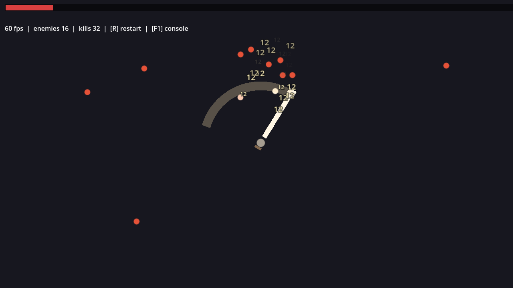

# OVERSIZED

A 2D top-down, melee-first Bullet Heaven / Survivors-like built in **Godot 4.7** (GDScript). One hero, one absurdly oversized sword that never stops swinging; endless enemy waves, a boss every 10 waves; run-scoped Sword Upgrades plus a persistent **Hero Level** that grows your roster of auto-casting Universal Abilities and passives — and your loadout budget, with a tag-driven synergy system tying it all together.

**Status:** Pre-production — Sprint 1.3 (meta loop: menu, summary, hub, saves). Vertical slice complete when this sprint's DoD passes.



## Docs

- [`docs/architecture.md`](docs/architecture.md) — concept, design pillars, systems, data model, risks
- [`docs/implementation-guide.md`](docs/implementation-guide.md) — Godot patterns, folder structure, horde-performance approach
- [`docs/sprint-roadmap.md`](docs/sprint-roadmap.md) — phase order, sprint contents, definitions of done
- [`AGENTS.md`](AGENTS.md) — how agents contribute: sprint workflow and hard rules
- [`worklog.md`](worklog.md) — one entry per completed sprint

## Running

Open the project in Godot 4.7.x, or:

```
godot --path .
```

Controls: **WASD / left stick** to move, **Space / gamepad A** to dash (no cooldown — never interrupts the swing), **R** restarts, **F1** opens the debug console (`spawn <n>`, `heal`, `wave <n>`, `restart`, `help`). Waves clear on a timer; every clear opens a 3-card Sword Upgrade choice.

## Tests

Headless logic tests (pool, spatial hash, sword swing state machine, damage):

```
godot --headless --path . --script res://tests/run_tests.gd
```

Benchmark (headless = logic-only cost, windowed = full render cost; the scene must be named explicitly now that the main scene is the game):

```
godot --headless --path . res://scenes/run/stress_test.tscn -- --bench
godot --path . res://scenes/run/stress_test.tscn -- --bench
```

Automated gameplay screenshot: `godot --path . -- --shot 330` (plays ~5s, saves to `user://sprint02_shot.png`).
