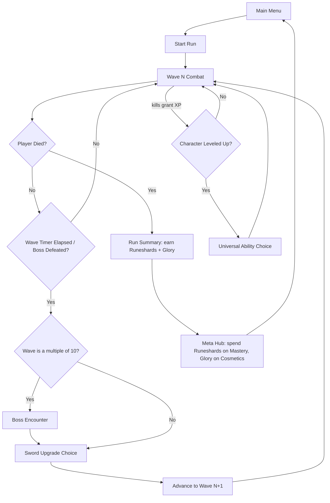
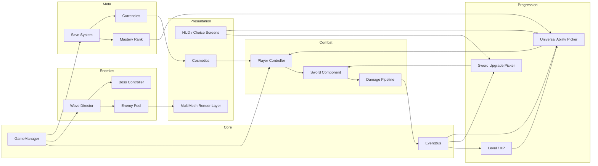

# Oversized — Architecture

*Working title: "Oversized" — purely a placeholder so the docs don't have to keep saying "the game." Swap it anytime; nothing below depends on the name.*

This is one of three linked documents:
- **architecture.md** (this file) — the systems, why they exist, and how they fit together.
- **implementation-guide.md** — concrete engineering patterns for building each system in Godot.
- **sprint-roadmap.md** — the order to build things in, and roughly how long each phase takes.

Read this one first. It's the shared vocabulary the other two lean on.

---

## 1. Concept Summary

A single hero wields one absurdly oversized sword that never stops swinging. Enemies arrive endlessly and in real numbers — this isn't a trickle, it's a flood. Every ten waves, a boss with its own unique attack kit interrupts the flow. Two independent progression tracks layer on top: the sword itself gets rebuilt every single run (pure roguelite, resets to zero each time), while a separate pool of auto-casting "Universal Abilities" grows *permanently* the more you play, so a level-up screen on run #50 offers wildly more (and wilder) options than it did on run #1. Cosmetics — skins for the hero and, especially, increasingly ridiculous swords — are earned through play and carry zero combat power.

Genre-wise this sits in **Bullet Heaven / Survivors-like**, but as a melee-first variant — most games in the genre (Vampire Survivors, Brotato) are ranged-auto-attack; a permanently-swinging oversized melee weapon as the core identity is a real point of differentiation, not just a reskin.

## 2. Precedent & Market Context

None of this is untested territory. Three games map closely onto different parts of this design:

| Game | Engine | Structure | Scale | What we're borrowing |
|---|---|---|---|---|
| **Brotato** | Godot | Discrete waves, shop/upgrade screen between each | 10M+ copies sold by 2025 | Single auto-attacking unit; wave-clear → upgrade screen rhythm; characters/skins unlocked through play |
| **Vampire Survivors** | Phaser, then Unity from v1.6 | Continuous run, level-up presents a card choice | 27M+ players; $4.99 | The level-up choice screen; a 2025 update added a coin-purchased cosmetic skin system |
| **Megabonk** | Unity, 3D | Procedurally-arranged arenas, solo-dev | 1.3M+ copies in 2 weeks (Sept 2025) | "Silver" — a permanent meta-currency earned through play that unlocks content; proof a solo/tiny team can hit this scale |

The takeaway: the genre rewards a tight, legible core loop and a strong visual hook far more than raw content volume at launch. An absurdly oversized sword is exactly the kind of hook that reads instantly in a Steam capsule image or a 10-second clip.

## 3. Design Pillars

These are the things every feature decision should be checked against.

1. **One hero, one (ridiculous) weapon.** The sword *is* the character concept. Everything about its presentation — size, swing weight, screen-shake, the sheer absurdity of a person dragging something that big — is doing marketing and game-feel work simultaneously.
2. **Two build axes that don't fight each other.** The sword resets every run (tension, variety, "did I get a good roll this time"). Universal Abilities are the long-term power fantasy (mastery, permanence, "I've unlocked so much"). Keeping them mechanically separate is what lets both feel good at once — see Section 6.
3. **Number go up, screen goes chaos.** The genre's core pleasure is escalating from fragile to absurd within one run. Enemy density should visibly overwhelm the screen; the sword and abilities should visibly trivialize that density by the run's back half.
4. **Cosmetics are bragging rights, not power.** No cosmetic item may carry a stat. This is a hard rule, not a guideline — see Section 7 and the corresponding implementation note.

## 4. Core Loop

Two things run in parallel during "Wave Combat": the wave clock (drives Sword Upgrade offers) and the XP bar (drives Universal Ability offers). They're deliberately decoupled — a player might level up mid-wave and get a sword pick at the wave boundary a few seconds later. That overlap is fine; it's more choice density, not a conflict.

**Wave clear conditions**, to be explicit: a normal wave ends when its timer (suggest 25-40s, tightening slightly as waves progress) elapses — enemies keep spawning the whole time, the timer isn't a "survive until safe" countdown. A **boss wave** replaces or supplements normal spawns with the boss; that wave ends only when the boss dies (its own enrage timer can serve as a soft difficulty floor so a boss fight can't be stalled forever).

## 5. The Two Build Tracks

This is the single most important design decision in the whole project — get this right and the rest mostly falls into place.

### 5.1 Sword Upgrades (wave-scoped, resets every run)

The sword's baseline behavior: swing, brief recovery, swing again — no cooldown gate, ever. It is always doing something. Every wave clear (boss or not) offers 2-3 Sword Upgrade choices drawn from a pool that resets to nothing at the start of each run. Upgrades are things like:

- Reach / arc width (bigger sword, literally — ties the power fantasy directly to the visual joke)
- Extra hitbox passes per swing (double-swing, spin finisher)
- Elemental infusions (fire DoT, frost slow, poison stacks, bleed)
- Lifesteal, knockback, execute-below-%-HP, chain-to-additional-target
- Windup/recovery reduction (the closest thing to an "attack speed" stat, since there's no cooldown to shorten) — stacked, this is the "fast combo flurry" feel; there are no input-sequence combos because there is no attack input, by design

**Combo-counter archetype** (confirmed design): the sword tracks consecutive *landed hits* — a full swing that connects with nothing resets the counter, so keeping the blade in meat is the skill that builds it. Upgrades hook thresholds: "every Nth swing is a Spin Finisher (360° arc, bonus damage)," "at max combo, release a shockwave burst," and so on. Combo-triggered effects belong to the sword track — they modify the sword's own rhythm and reset each run — while timed big effects (cooldown-based auto-casts) stay on the Universal Ability track; that keeps the two build lanes from competing (Section 5.3). Implementation-wise the counter lives in the pure-logic swing state machine (`implementation-guide.md` Section 5.1) and threshold effects route through the standard damage pipeline with a spatial-hash AoE query, exactly like the ability examples in `implementation-guide.md` Section 7.

Because this pool is fully reset each run, it's the primary source of "this run feels completely different from last run" — the roguelite promise.

### 5.2 Universal Abilities (level-scoped in-run, unlocked permanently via meta-progression)

Separate from the sword entirely: auto-casting effects with their own internal cooldown timers (an orbiting flame ring, a periodic ground-slam shockwave, a homing spirit blade) — "auto cast" means exactly that, no player input ever triggers them directly.

**Character Level** rises from in-run XP (kills drop XP, same convention as the rest of the genre) and resets every run. Each level-up offers 2-4 Universal Ability choices — new ability, or a rank-up of one already taken.

The permanence lives one layer up, in **Mastery Rank** — see Section 6. Mastery Rank doesn't touch the current run directly; it controls how big and how strong the *pool* is that level-up screens draw from. A player at Mastery Rank 1 sees a handful of basic options at every level-up. A player at Mastery Rank 40 sees a much deeper, higher-rarity-ceiling pool — more experimentation, more room to find something absurd. This is the direct mechanical answer to "as you get higher level, experimentation becomes more and more, as well as more OP."

### 5.3 Why keep them separate

If both tracks reset per run, there's no long-term progression hook. If both persist across runs, the roguelite tension disappears (every run starts strong, nothing to lose). Splitting them lets each track do one job well: Sword Upgrades supply *within-run* variance and tension; the Universal Ability pool (gated by Mastery Rank) supplies *across-run* growth and the "I've unlocked so much" feeling that keeps players coming back after a bad run.

## 6. Progression & Economy Model

| | Character Level | Mastery Rank |
|---|---|---|
| Scope | Resets every run | Persistent, account-wide |
| Driven by | XP from kills, this run only | Runeshards spent (earned per run) |
| Effect | Triggers a Universal Ability offer | Expands the pool size, rarity ceiling, and ability-slot cap available *at* level-up |

Two currencies, kept deliberately separate so a player is never forced to choose between "get stronger" and "look cool":

- **Runeshards** — earned per run (scaled to wave reached, bosses beaten). Spent only on Mastery Rank unlocks (new Universal Abilities entering the pool, higher rarity tiers, extra ability slots).
- **Glory** — earned per run (scaled to a different axis — style points, no-hit streaks, challenge completions, whatever fits later). Spent only on cosmetics.

### Suggested content budget (v1.0 targets)

Not commitments — starting targets so the roadmap has real numbers to schedule against.

| Content type | v1.0 target | Note |
|---|---|---|
| Sword Upgrades | 24-30 | Enough for run-to-run variety without a bloated choice screen |
| Universal Abilities | 25-35 (3-5 ranks each) | Full pool unlocks gradually via Mastery Rank, not all available day one |
| Base enemy types | 15-20 | Stat/behavior variants (fast, armored, ranged, explosive-on-death) stretch this further without new art |
| Hand-authored bosses | 6-8 (waves 10 through ~80) | Beyond that, "Champion" modifier stacking reuses the roster — see Section 9 |
| Cosmetic sets | 8-12 at launch | Hero skin + matching sword skin bundled as one unlock, so the sword's silhouette keeps evolving |

## 7. Systems Architecture

Module responsibilities, briefly:

- **GameManager / EventBus** — owns the state machine (Menu → Run → Summary → Hub) and a central signal bus so combat, progression, and UI don't hold direct references to each other.
- **Combat** — player movement (including the confirmed no-cooldown dash — `implementation-guide.md` Section 1), the sword's swing state machine, and the damage pipeline everything routes through (so crits, elemental effects, and lifesteal all have one place to hook in).
- **Enemies** — a wave director that reads data-driven wave definitions, an object pool (never `instantiate()` mid-combat), and a boss controller with its own telegraphed-attack state machine.
- **Progression** — XP/leveling and the two choice-screen pickers, each pulling from a different pool (run-local for sword, Mastery-gated for abilities).
- **Meta** — the save file, Mastery Rank logic, and the two currencies. This is the only system that persists across runs.
- **Presentation** — HUD, the shared choice-screen component, cosmetics application, and the horde-rendering layer (kept separate from enemy *logic* — see Section 10).

## 8. Data Model Overview

Conceptual shapes, not code (that's `implementation-guide.md`'s job) — but pinning down what fields matter now avoids rework later.

- **SwordUpgradeDef** — id, display name/icon, effect type (stat mod / on-hit effect / passive), magnitude, rarity weight, stacking rule.
- **UniversalAbilityDef** — id, display name/icon, cooldown, effect payload, max rank, per-rank scaling curve, Mastery Rank required to enter the pool.
- **EnemyDef** — id, base stats, movement behavior tag, spawn weight curve (by wave number), on-death effects.
- **WaveDef** — wave number, duration, enemy spawn budget/composition, boss reference (if applicable).
- **BossDef** — id, HP, phase thresholds, list of attack-pattern states, Champion-modifier compatibility flags (see Section 9).
- **CosmeticItemDef** — id, slot (hero skin / sword skin / trail / victory pose), Glory cost, unlock condition. Deliberately **has no stat fields at all** — see Section 6's hard rule.
- **RunState** (in-memory only) — current wave, HP, XP/level, active Sword Upgrades, active Universal Abilities, run-scoped stats.
- **MetaProgressionSave** (persisted) — Mastery Rank, Runeshards, Glory, unlocked ability-pool entries, unlocked/equipped cosmetics, best-wave-reached and other stat tracking.

## 9. Handling "Infinite" Enemies and Bosses

"Infinite" can't mean literally unbounded simulated entities — see the performance risk below — and "a unique boss every 10 waves forever" can't mean infinite hand-authored content either. The practical answers:

- **Enemies**: an ever-increasing spawn-rate and stat-scaling curve, paired with a hard concurrent-alive cap enforced by the object pool. The *feeling* of infinite density comes from the spawn queue always having more waiting, not from the simulation actually holding an unbounded number of live entities at once.
- **Bosses**: hand-author a roster for the first several tiers (waves 10, 20, 30, 40, 50, ...), then beyond that reuse the roster with stacking **Champion modifiers** (extra phase, faster attacks, an added elemental effect) — the same escalation pattern action-RPGs use for "elite" enemies. This is explicitly a content-production decision, not a cut corner: hand-authoring truly unique bosses forever isn't a solvable problem for a small team, and modifier-stacking is how the genre's peers (and most roguelites generally) handle it.

## 10. Technical Risks & Mitigations

| Risk | Impact | Mitigation |
|---|---|---|
| **Horde performance collapse at high enemy counts.** Godot's physics engine generates a collision-check pair for every nearby shape; a few hundred enemies clumped on the player can generate tens of thousands of checks per frame, and that's before the sword's swing hitbox is even in the picture. | The core fantasy ("plentiful enemies") breaks first, and it breaks silently — frame rate degrades gradually until it's unplayable. | De-risk this in the very first sprint with a stress-test prototype (see `sprint-roadmap.md`, Sprint 0.1). Enemies should not use full physics bodies at scale — manual position updates plus a spatial hash for neighbor queries, detailed in `implementation-guide.md`. |
| Dual progression systems compete for the same "power budget" and one track ends up irrelevant | Runs feel either trivial (both tracks overtuned) or unfair (undertuned) | Keep Sword Upgrades weighted toward utility/consistency, Universal Abilities weighted toward power spikes. Give balance its own dedicated sprint rather than tuning opportunistically. |
| Content-volume expectations for "infinite" replayability outpace what a small team can hand-author | Runs start feeling repetitive after a handful of sessions | Endless scaling via curves (Section 9) plus modifier-stacking bosses, rather than committing to infinite unique content. |
| Scope creep, especially solo/small-team | Missed milestones, indefinitely-delayed demo | The non-goals list below is held firm through v1.0; roadmap phases are scope-gated (defined by what's built) rather than purely date-gated. |

## 11. Engine & Platform Decision

**Godot 4.7.x**, GDScript as the primary language (fast iteration, which this genre's constant numeric tuning rewards), with C# available as an escape hatch for anything that turns out to be CPU-bound (most likely candidate: the enemy-update loop at very high counts). Godot carries no licensing cost and no revenue-based fee at any scale — a real consideration given the genre's history with the Unity runtime-fee controversy. Brotato is direct proof this exact game shape scales to a 10-million-copy hit on this engine.

**Platform**: PC via Steam, single-player, for v1.0. Console/mobile ports are realistic *later* moves (every comparable title in Section 2 eventually shipped to consoles or mobile) but are explicitly out of scope for initial development — see below.

## 12. Non-Goals for v1.0

Explicitly out of scope, to protect the schedule:

- Multiplayer / co-op (several genre peers added this post-launch, not at launch)
- Console ports (Godot's export pipeline supports it later without an architecture rewrite, if the core systems avoid platform-specific assumptions)
- Full controller remapping / accessibility beyond the basics (rebinding, colorblind-safe telegraphs, audio sliders)
- Mod support
- Narrative/story systems
- Hand-crafted level layouts — combat takes place in a small number of arena spaces, not a level-by-level campaign

## 13. Assumptions Log

Stated plainly so anything here can be corrected without derailing the rest of the docs:

- Visual style: **2D top-down**, not 3D. (Reasoning: closest precedent — Brotato — is 2D; a comically oversized weapon reads *more* clearly as a 2D silhouette gag; cheaper to produce for a small team.)
- Engine: **Godot 4.7**, GDScript-first.
- Platform: **PC / Steam**, single-player, premium one-time purchase (no free-to-play, no real-money cosmetic shop — cosmetics are earned through play only, matching every precedent cited above).
- Team size / pace: **not specified** — `sprint-roadmap.md` gives dual estimates (solo/duo part-time, and full-time solo-or-small-team) rather than assuming one.
- Working title: **"Oversized"** — a placeholder, not a proposal to be attached to.
- One hero at launch, with additional heroes/weapons treated as a realistic post-launch content axis rather than a v1.0 requirement.
