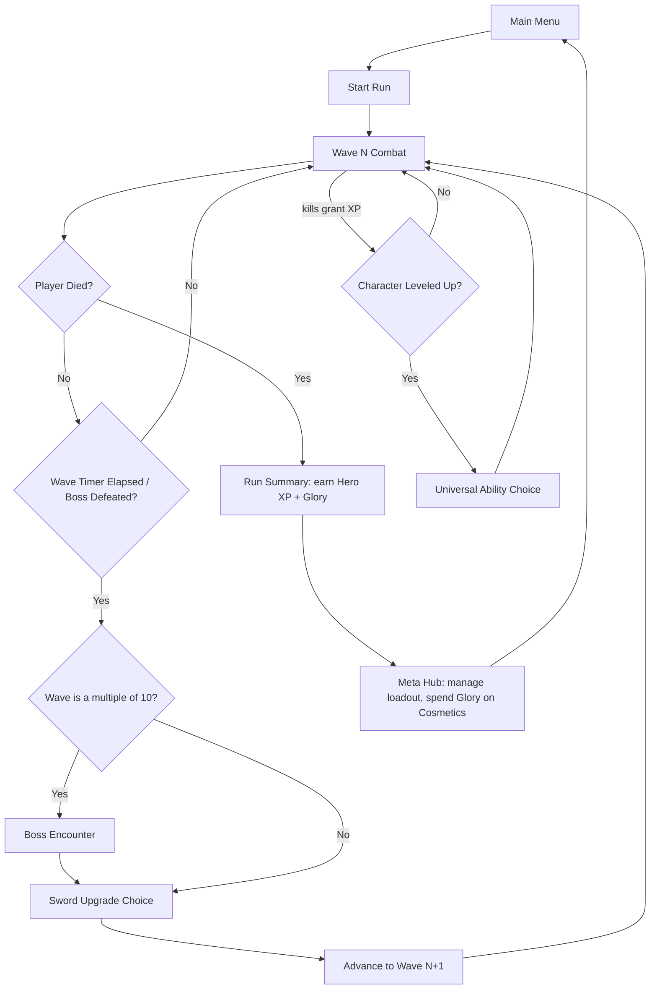
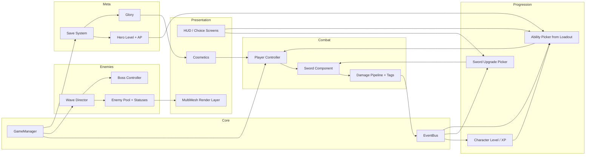

# Oversized — Architecture

*Working title: "Oversized" — purely a placeholder so the docs don't have to keep saying "the game." Swap it anytime; nothing below depends on the name.*

This is one of three linked documents:
- **architecture.md** (this file) — the systems, why they exist, and how they fit together.
- **implementation-guide.md** — concrete engineering patterns for building each system in Godot.
- **sprint-roadmap.md** — the order to build things in, and roughly how long each phase takes.

Read this one first. It's the shared vocabulary the other two lean on.

---

## 1. Concept Summary

A single hero wields one absurdly oversized sword that never stops swinging. Enemies arrive endlessly and in real numbers — this isn't a trickle, it's a flood. Every ten waves, a boss with its own unique attack kit interrupts the flow. Two independent progression tracks layer on top: the sword itself gets rebuilt every single run (pure roguelite, resets to zero each time), while your permanently-owned roster of Universal Abilities and passives grows the more you play — and a loadout system makes you choose which ones you bring, so a run at Hero Level 30 is a different shape than one at Hero Level 5. Cosmetics — skins for the hero and, especially, increasingly ridiculous swords — are earned through play and carry zero combat power.

Genre-wise this sits in **Bullet Heaven / Survivors-like**, but as a melee-first variant — most games in the genre (Vampire Survivors, Brotato) are ranged-auto-attack; a permanently-swinging oversized melee weapon as the core identity is a real point of differentiation, not just a reskin.

## 2. Precedent & Market Context

None of this is untested territory. Three games map closely onto different parts of this design:

| Game | Engine | Structure | Scale | What we're borrowing |
|---|---|---|---|---|
| **Brotato** | Godot | Discrete waves, shop/upgrade screen between each | 10M+ copies sold by 2025 | Single auto-attacking unit; wave-clear → upgrade screen rhythm; characters/skins unlocked through play |
| **Vampire Survivors** | Phaser, then Unity from v1.6 | Continuous run, level-up presents a card choice | 27M+ players; $4.99 | The level-up choice screen; a 2025 update added a coin-purchased cosmetic skin system |
| **Megabonk** | Unity, 3D | Procedurally-arranged arenas, solo-dev | 1.3M+ copies in 2 weeks (Sept 2025) | "Silver" — a permanent meta-currency earned through play that unlocks content; proof a solo/tiny team can hit this scale |

The takeaway: the genre rewards a tight, legible core loop and a strong visual hook far more than raw content volume at launch. An absurdly oversized sword is exactly the kind of hook that reads instantly in a Steam capsule image or a 10-second clip.

## 3. Design Pillars

These are the things every feature decision should be checked against.

1. **One hero, one (ridiculous) weapon.** The sword *is* the character concept. Everything about its presentation — size, swing weight, screen-shake, the sheer absurdity of a person dragging something that big — is doing marketing and game-feel work simultaneously.
2. **Two build axes that don't fight each other.** The sword resets every run (tension, variety, "did I get a good roll this time"). Universal Abilities and passives are the long-term power fantasy (ownership, loadout-building, permanence). Keeping them mechanically separate is what lets both feel good at once — see Section 6.
3. **Number go up, screen goes chaos.** The genre's core pleasure is escalating from fragile to absurd within one run. Enemy density should visibly overwhelm the screen; the sword and abilities should visibly trivialize that density by the run's back half.
4. **Cosmetics are bragging rights, not power.** No cosmetic item may carry a stat. This is a hard rule, not a guideline — see Section 6 and the corresponding implementation note.

## 4. Core Loop

Two things run in parallel during "Wave Combat": the wave clock (drives Sword Upgrade offers) and the XP bar (drives Universal Ability offers). They're deliberately decoupled — a player might level up mid-wave and get a sword pick at the wave boundary a few seconds later. That overlap is fine; it's more choice density, not a conflict.

**Wave clear conditions**, to be explicit: a normal wave ends when its timer (suggest 25-40s, tightening slightly as waves progress) elapses — enemies keep spawning the whole time, the timer isn't a "survive until safe" countdown. A **boss wave** replaces or supplements normal spawns with the boss; that wave ends only when the boss dies (its own enrage timer can serve as a soft difficulty floor so a boss fight can't be stalled forever).

## 5. The Two Build Tracks

This is the single most important design decision in the whole project — get this right and the rest mostly falls into place.

### 5.1 Sword Upgrades (wave-scoped, resets every run)

The sword's baseline behavior: swing, brief recovery, swing again — no cooldown gate, ever. It is always doing something. Every wave clear (boss or not) offers 2-3 Sword Upgrade choices drawn from a pool that resets to nothing at the start of each run. Upgrades are things like:

- Reach / arc width (bigger sword, literally — ties the power fantasy directly to the visual joke)
- Extra hitbox passes per swing (double-swing, spin finisher)
- Elemental infusions (fire DoT, frost slow, poison stacks, bleed)
- Lifesteal, knockback, execute-below-%-HP, chain-to-additional-target
- Windup/recovery reduction (the closest thing to an "attack speed" stat, since there's no cooldown to shorten) — stacked, this is the "fast combo flurry" feel; there are no input-sequence combos because there is no attack input, by design

**Combo-counter archetype** (confirmed design): the sword tracks consecutive *landed hits* — a full swing that connects with nothing resets the counter, so keeping the blade in meat is the skill that builds it. Upgrades hook thresholds: "every Nth swing is a Spin Finisher (360° arc, bonus damage)," "at max combo, release a shockwave burst," and so on. Combo-triggered effects belong to the sword track — they modify the sword's own rhythm and reset each run — while timed big effects (cooldown-based auto-casts) stay on the Universal Ability track; that keeps the two build lanes from competing (Section 5.3). Implementation-wise the counter lives in the pure-logic swing state machine (`implementation-guide.md` Section 5.1) and threshold effects route through the standard damage pipeline with a spatial-hash AoE query, exactly like the ability examples in `implementation-guide.md` Section 7.

Because this pool is fully reset each run, it's the primary source of "this run feels completely different from last run" — the roguelite promise.

### 5.2 Universal Abilities & passives (run-scoped play, owned permanently)

Two kinds, and both are auto-cast — no player input path exists for either:

- **Actives** — auto-casting abilities with their own cooldown timers or persistent effects (an orbiting flame ring, a periodic ground-slam shockwave, a homing spirit blade). AP cost 2–5: light utility = 2, standard = 3, strong = 4, build-defining = 5.
- **Passives** — always-on effects with no cooldown and no cast. They cover character stats (max HP, regen, move speed, pickup radius, XP gain, armor) and tag amplifiers ("+25% Fire damage"). AP cost 1–3, averaging ~2. Passives stay off the sword's turf: sword shape, reach, and on-hit effects belong to Sword Upgrades; passives modify the *character* and the *tag economy* (Section 5.4).

Three layers, from permanent to per-run:

| Layer | Scope | What it controls |
|---|---|---|
| **Hero Level** | Persistent, account-wide | Which abilities you *own*, and how many **AP** you have |
| **Loadout** | Chosen in the hub before each run | Which owned abilities you *bring*, within your AP budget |
| **Character Level** | Resets every run | Which of your equipped abilities come online / rank up during the run |

- **Hero Level** rises from XP earned across runs (scaled to waves survived, kills, bosses). It unlocks abilities at defined levels (`roster_unlocks` in a data-driven `ProgressionCurve` — not every level unlocks something; AP-only levels still pay out) and grows the **AP budget**. AP cost is fixed regardless of rank — ranks are run-scoped, so charging AP for them would double-tax.
- **The budget grows slower than the roster**, so the choice tightens as you progress: early you bring everything you own; later you own more than you can equip, and *building the loadout becomes the game before the game*.

| Hero Level | Owned (actives+passives) | AP budget | Roughly equippable |
|---|---|---|---|
| 1 | 2 | 5 | all |
| 10 | 5 (3+2) | 14 | all 5 |
| 20 | 10 (6+4) | 24 | ~8 of 10 |
| 30 | 14 (9+5) | 31 | ~10 of 14 |
| 50 | 24 (15+9) | 36 | 12 (slot cap) |

- **Loadout rules**: hard cap of 12 equipped slots regardless of AP (bounds UI complexity and the per-frame ability-update cost); free, instant respec (trying on builds, not committing); 3–5 saved named presets, because synergy builds (Section 5.4) are hard to reassemble by hand. The whole curve is a `ProgressionCurve` resource — retuning progression is a spreadsheet edit, not code (see `implementation-guide.md` §3).
- **In-run level-up cards draw from the equipped loadout only**: bring an equipped-but-inactive active online at rank 1, or rank up an active (max rank 5) or a passive (max rank 3, smaller steps). One **opening ability** starts each run online (2 at Hero Level 20+ — tuning knob); **passives are on from run start** at rank 1, no card needed. A per-run allotment of 2 rerolls and 1 banish (banish removes a card from this run's offers) is the player's tool for steering toward a synergy.
- **The consequence for pool size**: your equipped loadout *is* the level-up pool. A level-30 player with 10 equipped abilities sees materially more variety at each level-up than a level-10 player with 5 — the same "as you level, experimentation grows and gets more OP" promise, now with a hard lever behind it.
- **Unlock sources**: primarily Hero Level (suggested mix ~60% actives / ~40% passives — passives need an icon and no bespoke VFX, making them the cheap roster lever if production falls behind). Secondarily, a handful of "trophy" abilities unlocked by first-time boss kills, giving late-game players a reason to chase specific fights. Roster math: ~24 level-gated abilities by level 50 plus 6–8 trophies ≈ the 30–32 total the original budget targeted.

The permanence design replaces the earlier "Mastery Rank / Runeshards" model (merged from the systems deep-dive, 2026-09-29): one persistent power axis (Hero Level + AP) and one currency (Glory, cosmetics only) — see Section 6.

### 5.3 Why keep them separate

If both tracks reset per run, there's no long-term progression hook. If both persist across runs, the roguelite tension disappears (every run starts strong, nothing to lose). Splitting them lets each track do one job well: Sword Upgrades supply *within-run* variance and tension; the owned-but-not-equipped loadout gap (Hero Level + AP budget) supplies *across-run* growth and the "I've unlocked so much" feeling that keeps players coming back after a bad run.

### 5.4 The Synergy System — tags, reactions, resonance, evolutions

A bigger ability pool alone just means more things that each work in isolation. Experimentation only becomes *fun* when picks interact — when taking a fire sword upgrade changes what your ground slam does. The mechanism is **tags**, and the two build tracks share one vocabulary so they can talk to each other.

**Tag taxonomy (starting set, ~20):**

| Group | Tags | Purpose |
|---|---|---|
| **Element** | Fire, Frost, Shock, Poison, Blood | What flavor of damage/status something carries |
| **Delivery** | Slash, Orbit, Burst, Projectile, Summon, Zone | *How* it reaches enemies |
| **Status** | Burn, Chill, Shocked, Poisoned, Bleed, Stun | Applied conditions on enemies (Fire→Burn, Frost→Chill, …) |
| **Behavior** | OnHit, OnKill, Periodic, Crit, Lifesteal, Knockback, Execute | When/why an effect fires |

Every `SwordUpgradeDef` and `UniversalAbilityDef` carries a tag set (stored as a bitmask — implementation in `implementation-guide.md` §3). Everything that deals damage emits one hit event through the single damage pipeline (§7) carrying `{source_id, tag_mask, base_damage, is_crit, position, target_index}`; everything that reacts subscribes via the `EventBus` and filters by mask — no ability needs to know any other ability exists. Statuses on enemies are horde-safe flat arrays (`status_mask` + per-status timers in the sim layer — `implementation-guide.md` §6), not child nodes.

**Four mechanisms, in build order:**

1. **Tag amplifiers** — the baseline. "+25% Fire damage" applies to any source carrying Fire, sword infusion or flame ring alike. Passives are the natural home: a 2-AP amplifier passive rewards committing to a theme, and conditionals like "Burning enemies take extra Slash damage" tie the sword's hits into your ability loadout.
2. **Reactions** — two statuses meeting produce a new effect. Starting set:

| Reaction | Trigger | Effect |
|---|---|---|
| **Steam Burst** | Burning enemy takes a Frost hit (or vice versa) | Small AoE burst around the target |
| **Shatter** | Max-Chill enemy takes a heavy Slash hit | Bonus damage + guaranteed crit |
| **Contagion** | Poisoned enemy takes a Shock hit | Poison spreads to nearby enemies |
| **Blood Boil** | Bleeding enemy dies while Burning | Explodes, dealing AoE Fire damage |
| **Overload** | Shocked enemy hit by an Orbit source | Chain arc to 2 nearby enemies |

3. **Resonance** — a *loadout-level* bonus for committing to a theme: equip 3+ abilities sharing a tag for a tier-1 bonus, 5+ for tier-2 (e.g., "Pyre Resonance: Burn spreads to adjacent enemies on kill"). This is where AP and synergy meet — a themed loadout spends limited AP on *coherence* rather than raw ability count.
4. **Evolutions** — the genre's classic payoff: a specific ability at max rank plus a specific Sword Upgrade transforms into a stronger evolved form. Data-driven (`EvolutionDef { ability_id, requires_upgrade_id, result_id }`); show a recipe hint in the UI once discovered so the chase is visible. Target ~3 for EA, 6–8 for 1.0.

**Damage math and guardrails** (chain reactions are the whole appeal, so runaway procs are the whole risk):

- Two modifier categories, standard ARPG convention: `final = base × (1 + Σ increased) × Π more`. **Increased** is additive within its pool (most amplifiers — safe, hard to break); **More** is multiplicative, rare, and each source is deliberate. Cap how many "More" sources stack.
- **Proc depth limit of 2** — a reaction can trigger another reaction once, then stops.
- **Internal cooldowns** on OnHit/OnKill effects, so 300 enemies dying in one frame can't fire 300 explosions.
- **Proc coefficient** — hits from abilities/reactions trigger further effects at reduced rate (~0.5) versus direct sword hits.
- **Global effect budget** — cap simultaneous spawned effects, enforced by the same pooling layer as enemies.

**Offer weighting**: level-up and wave-clear cards get a mild synergy bias — multiply a card's weight by `1 + 0.25 × (matching active tags)`, capped. The game feels like it's helping you build something without becoming deterministic; rerolls and banishes are the player's corrective tools.

**Content rules**: coverage rule for 1.0 — every tag has ≥3 producers and ≥2 consumers (a tag nothing reacts to is dead weight); maintain a synergy matrix (spreadsheet: rows = abilities/upgrades, columns = tags, produce/consume) checked at each content-sprint boundary; an editor validation script loads all content `.tres` and fails on unknown tags, orphaned evolution recipes, or zero-consumer tags. Design toward at least six viable archetypes, each assemblable inside a level-20 AP budget (≤24): **Pyre** (Fire/Burn/Burst — everything's on fire and it spreads), **Blood Knight** (Blood/Bleed/Lifesteal/Crit — trade risk for sustain and spikes), **Storm** (Shock/Orbit/Periodic — chain lightning and a whirling ring), **Frostbite** (Frost/Chill/Slash — freeze the crowd, shatter it with the sword), **Swarm** (Summon/OnKill — kills feed an ever-growing army), **Juggernaut** (Slash/Knockback/Execute — pure sword: bigger, heavier, harder). If an archetype can't be assembled inside the level-20 budget, the costs or unlock levels are wrong — a useful automated balance check.

## 6. Progression & Economy Model

Power progression has exactly one persistent axis — **Hero Level** (unlocks + AP budget, Section 5.2) — and exactly **one currency**:

- **Glory** — earned per run (scaled to waves survived, kills, bosses — and later to style axes like no-hit streaks or challenge completions if useful). Spent only on cosmetics. The old second currency (Runeshards → Mastery Rank) was removed in the deep-dive merge (2026-09-29): Hero Level already provides the across-run power hook, and a single "get stronger by playing / look cool with Glory" split means a player is never asked to choose between power and looks with the same wallet. Revisit only if a second sink is ever genuinely needed (open decision, Section 13).

**Staged content budget** — tying content tiers to the Hero Level cap lets the game ship in honest tiers instead of all-or-nothing. These replace the earlier flat v1.0 budget; the 1.0 column is a post-EA target, not a launch gate:

| Content | Demo (cap 20) | Early Access (cap 30) | 1.0 (cap 50) |
|---|---|---|---|
| Universal Abilities owned (active+passive) | 10 (6+4) | 14 (9+5), plus trophy abilities | ~24 (15+9), plus trophy abilities |
| Sword Upgrades | 12 | 20 | 24-30 |
| Base enemy types | 8-10 | 15 | 20 |
| Hand-authored bosses | 2 (waves 10, 20) | 4 (waves 10-40) | 6-8 |
| Evolutions | 1 | 3 | 6-8 |
| Cosmetic sets | 3 | 6 | 8-12 |
| Music tracks | 3-4 | 5-6 | 8+ |

A demo capped at Hero Level 20 is also a good pitch: it shows the "you can bring most but not all" AP crunch — the system's best selling point — within a slice players can actually finish.

## 7. Systems Architecture

Module responsibilities, briefly:

- **GameManager / EventBus** — owns the state machine (Menu → Run → Summary → Hub) and a central signal bus so combat, progression, and UI don't hold direct references to each other. Reactions and synergy triggers also subscribe here, filtering hit events by tag mask (§5.4).
- **Combat** — player movement (including the confirmed no-cooldown dash — `implementation-guide.md` Section 1), the sword's swing state machine, and the damage pipeline everything routes through (so crits, elemental effects, and lifesteal all have one place to hook in). Every hit event carries a tag bitmask (§5.4).
- **Enemies** — a wave director that reads data-driven wave definitions, an object pool (never `instantiate()` mid-combat) with flat-array status storage, and a boss controller with its own telegraphed-attack state machine.
- **Progression** — in-run XP/leveling and the two choice-screen pickers, each pulling from a different source (run-local pool for sword picks, the equipped loadout for ability picks).
- **Meta** — the save file, Hero Level + AP/loadout state, and Glory. This is the only system that persists across runs.
- **Presentation** — HUD, the shared choice-screen component, cosmetics application, and the horde-rendering layer (kept separate from enemy *logic* — see Section 10).

## 8. Data Model Overview

Conceptual shapes, not code (that's `implementation-guide.md`'s job) — but pinning down what fields matter now avoids rework later.

- **SwordUpgradeDef** — id, display name/icon, effect type (stat mod / on-hit effect / passive), magnitude, rarity weight, stacking rule, tag set (§5.4).
- **UniversalAbilityDef** — id, display name/icon, `kind` (active / passive — passives have no cooldown and are on from run start), cooldown (actives), effect payload, `ap_cost` (actives 2–5, passives 1–3), `max_rank` (5 actives / 3 passives), `unlock_level`, tag set (§5.4).
- **ProgressionCurveDef** — `xp_required[level]`, `ap_budget[level]`, `slot_cap` (12), `roster_unlocks[level] → ability ids`. The entire progression feel in one data file.
- **EvolutionDef** — `ability_id`, `requires_upgrade_id`, `result_id`. The synergy payoff (§5.4).
- **EnemyDef** — id, base stats, movement behavior tag, spawn weight curve (by wave number), on-death effects, tag set.
- **WaveDef** — wave number, duration, enemy spawn budget/composition, boss reference (if applicable).
- **BossDef** — id, HP, phase thresholds, list of attack-pattern states, Champion-modifier compatibility flags (see Section 9).
- **CosmeticItemDef** — id, slot (hero skin / sword skin / trail / victory pose), Glory cost, unlock condition. Deliberately **has no stat fields at all** — see Section 6's hard rule.
- **RunState** (in-memory only) — current wave, HP, XP/character level, active loadout ranks, active Sword Upgrades, run-scoped stats.
- **MetaProgressionSave** (persisted) — `hero_xp`, `hero_level`, `loadouts` (named ability-id sets) + `last_loadout_index`, unlocked abilities, Glory, unlocked/equipped cosmetics, best-wave-reached and other stat tracking. Carries `schema_version` from the very first file (`implementation-guide.md` §10) — the Mastery-Rank→Hero-Level change is exactly the migration scenario that field exists for.

## 9. Handling "Infinite" Enemies and Bosses

"Infinite" can't mean literally unbounded simulated entities — see the performance risk below — and "a unique boss every 10 waves forever" can't mean infinite hand-authored content either. The practical answers:

- **Enemies**: an ever-increasing spawn-rate and stat-scaling curve, paired with a hard concurrent-alive cap enforced by the object pool. The *feeling* of infinite density comes from the spawn queue always having more waiting, not from the simulation actually holding an unbounded number of live entities at once.
- **Bosses**: hand-author a roster for the first several tiers (waves 10, 20, 30, 40, 50, ...), then beyond that reuse the roster with stacking **Champion modifiers** (extra phase, faster attacks, an added elemental effect) — the same escalation pattern action-RPGs use for "elite" enemies. This is explicitly a content-production decision, not a cut corner: hand-authoring truly unique bosses forever isn't a solvable problem for a small team, and modifier-stacking is how the genre's peers (and most roguelites generally) handle it.

## 10. Technical Risks & Mitigations

| Risk | Impact | Mitigation |
|---|---|---|
| **Horde performance collapse at high enemy counts.** Godot's physics engine generates a collision-check pair for every nearby shape; a few hundred enemies clumped on the player can generate tens of thousands of checks per frame, and that's before the sword's swing hitbox is even in the picture. | The core fantasy ("plentiful enemies") breaks first, and it breaks silently — frame rate degrades gradually until it's unplayable. | De-risk this in the very first sprint with a stress-test prototype (see `sprint-roadmap.md`, Sprint 0.1). Enemies should not use full physics bodies at scale — manual position updates plus a spatial hash for neighbor queries, detailed in `implementation-guide.md`. |
| Dual progression systems compete for the same "power budget" and one track ends up irrelevant | Runs feel either trivial (both tracks overtuned) or unfair (undertuned) | Keep Sword Upgrades weighted toward utility/consistency, Universal Abilities weighted toward power spikes. Give balance its own dedicated sprint rather than tuning opportunistically. |
| Content-volume expectations for "infinite" replayability outpace what a small team can hand-author | Runs start feeling repetitive after a handful of sessions | Endless scaling via curves (Section 9) plus modifier-stacking bosses, rather than committing to infinite unique content. |
| Scope creep, especially solo/small-team | Missed milestones, indefinitely-delayed demo | The non-goals list below is held firm through v1.0; roadmap phases are scope-gated (defined by what's built) rather than purely date-gated. |

## 11. Engine & Platform Decision

**Godot 4.7.x**, GDScript as the primary language (fast iteration, which this genre's constant numeric tuning rewards), with C# available as an escape hatch for anything that turns out to be CPU-bound (most likely candidate: the enemy-update loop at very high counts). Godot carries no licensing cost and no revenue-based fee at any scale — a real consideration given the genre's history with the Unity runtime-fee controversy. Brotato is direct proof this exact game shape scales to a 10-million-copy hit on this engine.

**Platform**: PC via Steam, single-player, for v1.0. Console/mobile ports are realistic *later* moves (every comparable title in Section 2 eventually shipped to consoles or mobile) but are explicitly out of scope for initial development — see below.

## 12. Non-Goals for v1.0

Explicitly out of scope, to protect the schedule:

- Multiplayer / co-op (several genre peers added this post-launch, not at launch)
- Console ports (Godot's export pipeline supports it later without an architecture rewrite, if the core systems avoid platform-specific assumptions)
- Full controller remapping / accessibility beyond the basics (rebinding, colorblind-safe telegraphs, audio sliders)
- Mod support
- Narrative/story systems
- Hand-crafted level layouts — combat takes place in a small number of arena spaces, not a level-by-level campaign

## 13. Assumptions Log

Stated plainly so anything here can be corrected without derailing the rest of the docs:

- Visual style: **2D top-down**, not 3D. (Reasoning: closest precedent — Brotato — is 2D; a comically oversized weapon reads *more* clearly as a 2D silhouette gag; cheaper to produce for a small team.)
- Engine: **Godot 4.7**, GDScript-first.
- Platform: **PC / Steam**, single-player, premium one-time purchase (no free-to-play, no real-money cosmetic shop — cosmetics are earned through play only, matching every precedent cited above).
- Economy (settled 2026-09-29, systems deep-dive merge): **one persistent power axis** (Hero Level + AP loadouts) and **one currency** (Glory, cosmetics only). Runeshards/Mastery Rank were removed; revisit only if a second sink is genuinely needed.
- Art (settled 2026-09-29): **pixel art, no commissions** — self-made plus licensed/CC0 packs, unified by palette (see `implementation-guide.md` §16). Base resolution recommended **640×360** (integer-scales to 1080p/1440p/4K); decide by end of Phase 1.
- Team size / pace: **two people, no calendar commitments** — phases are scope-gated (`sprint-roadmap.md` §1). All effort figures in the docs are planning guesses to be re-measured, not data.
- Working title: **"Oversized"** — a placeholder, not a proposal to be attached to.
- One hero at launch, with additional heroes/weapons treated as a realistic post-launch content axis rather than a v1.0 requirement.

### Open decisions (defaults chosen; revisit when the trigger says so)

| # | Decision | Default | Revisit when |
|---|---|---|---|
| 1 | Runeshards removed for v1? | Yes | A second sink is genuinely needed |
| 2 | Hero Level cap 50, roster ~24 + trophies | Yes | Playtest shows pacing off |
| 3 | Trophy (boss-kill) abilities | Yes, a few | — |
| 4 | Opening kit: 1 ability, 2 at Hero Level 20+ | Yes | Playtest |
| 5 | Base resolution 640×360 | Yes | Decide by end of Phase 1 |
| 6 | No commissions; self + licensed packs | Yes | The Sprint 2.3 art timing exercise says otherwise |
| 7 | Layered music via `AudioStreamInteractive`/`Synchronized` | Yes | Verify exact API in 4.7 docs before building |
| 8 | Passives share the 12-slot cap with actives | Yes | If passives crowd out actives |
| 9 | Passives rank up in-run, max 3 | Yes | Playtest |
