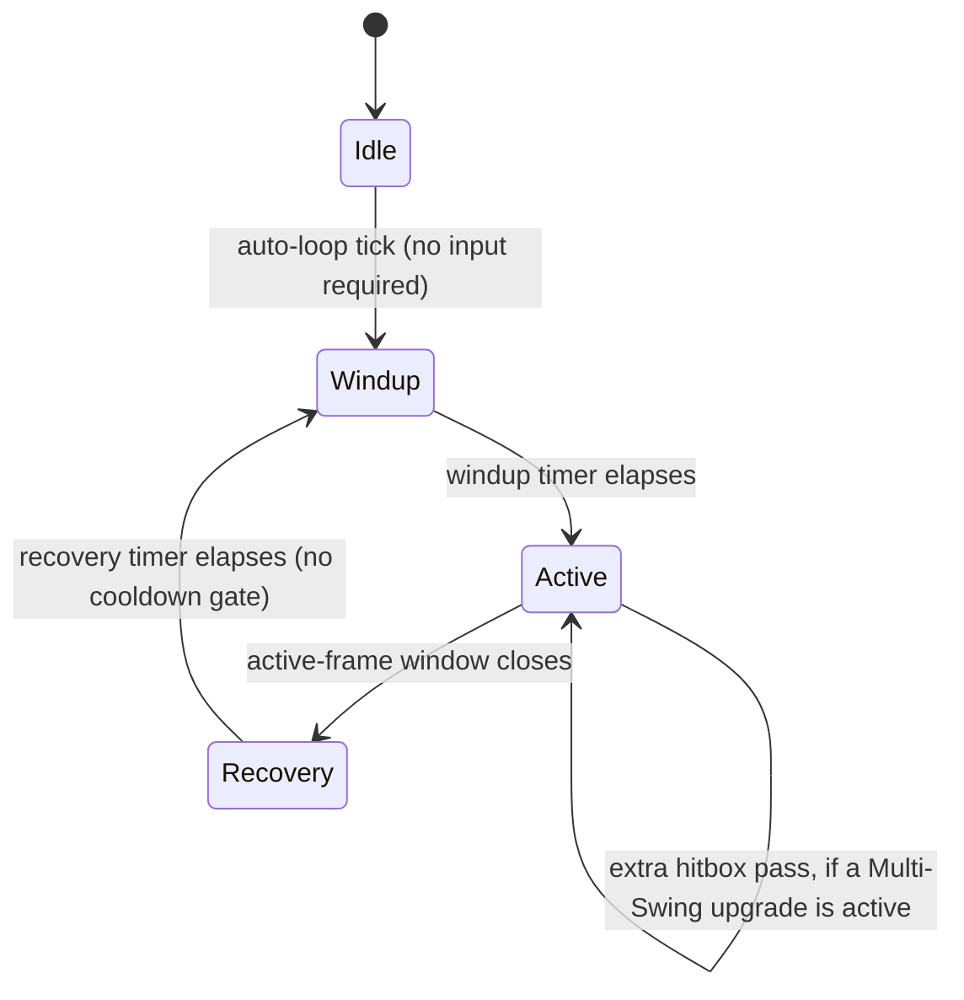

# Oversized — Implementation Guide

Companion to `architecture.md` (the "why") and `sprint-roadmap.md` (the "when"). This document is the "how" — concrete Godot patterns, folder structure, and the specific engineering decisions that make the horde-scale, dual-progression design in `architecture.md` actually run well.

Assumes Godot 4.7.x and GDScript as the default language, per the engine decision in `architecture.md`. Where a system is CPU-bound enough to justify it, a C# rewrite path is noted — Godot supports both in the same project.

---

## 1. Project Setup

- **Engine version**: pin to a specific Godot 4.7.x point release for the whole project (check the editor's Help menu / godotengine.org for the current patch — 4.7.1 and later maintenance releases exist and are safe upgrades within the 4.7 line). Re-pin deliberately when moving to 4.8, not automatically.
- **Renderer**: Forward+ is fine for 2D; it doesn't meaningfully cost more than the Mobile renderer for a top-down 2D game and keeps 3D options open if a later cosmetic effect wants it.
- **Physics tick**: leave default (60) initially; revisit only if the horde-performance work in Section 6 demands it.
- **Input map**: keep it deliberately small. Movement (WASD / left stick) is the only input most of the time, consistent with "abilities auto-cast." One active input is confirmed: a **dash/dodge**, built in Sprint 1.1. Design (settled 2026-09-28): **no cooldown** — the ninja fantasy is dashing whenever you want — implemented as a short fixed-distance velocity impulse with brief i-frames. It never touches the sword's swing state machine (movement and swing are decoupled systems), so dashing never interrupts or pauses the auto-swing; hit-and-run is the intended rhythm. Balance watch-item: unlimited mobility can trivialize "getting surrounded," the genre's core threat — if Phase 3's balance pass agrees, the fix is a subtle regulator (e.g., stamina pips), not a cooldown. (Megabonk's jump/slide is the genre precedent for free-movement skill expression.) Basic gamepad support is in scope from day one: every input action gets a gamepad binding when it's defined (left stick for movement, a face button for dash), and menus/choice screens lean on Godot's built-in `ui_*` gamepad navigation — with movement as the only real input, full gamepad play is nearly free and matters for Steam Deck–style handheld play. Full controller remapping remains a v1.0 non-goal (`architecture.md` Section 12).

## 2. Folder & Scene Structure

```
res://
  autoload/
    game_manager.gd
    event_bus.gd
    meta_progression.gd
    audio_bus.gd
  scenes/
    main_menu/
    run/
      run.tscn
      player/
        player.tscn
        player.gd
        sword.tscn
        sword.gd
      enemies/
        enemy_pool.tscn
        enemy_pool.gd
        boss/
      wave_director/
        wave_director.gd
    ui/
      hud/
      choice_screen/       # shared by both Sword and Ability picks
      meta_hub/
  resources/
    sword_upgrades/         # .tres files, one per upgrade
    universal_abilities/    # .tres files, one per ability
    enemies/
    waves/
    bosses/
    cosmetics/
  scripts/
    resource_defs/          # the Resource class_name scripts (schemas)
  assets/
    sprites/
    audio/
    fonts/
```

The `resources/` split matters: every piece of tunable content is a `.tres` file, not hardcoded in a script. That's what lets 24-30 sword upgrades and 25-35 abilities get built and rebalanced without touching combat code — see Section 3.

## 3. Data-Driven Content Pattern

Define each content type as a Resource subclass — a schema, not a scene. Example for a Sword Upgrade:

```gdscript
# scripts/resource_defs/sword_upgrade_def.gd
class_name SwordUpgradeDef
extends Resource

@export var id: StringName
@export var display_name: String
@export var icon: Texture2D
@export_enum("stat_mod", "on_hit_effect", "passive") var effect_type: String
@export var magnitude: float
@export var rarity_weight: float = 1.0
@export var stacks: bool = true
```

Each actual upgrade is then a `.tres` resource file built in the inspector (or generated), not a new script. A `ContentLoader` autoload scans `res://resources/sword_upgrades/` at startup and builds the in-memory pool:

```gdscript
# autoload/content_loader.gd (excerpt)
func load_sword_upgrades() -> Array[SwordUpgradeDef]:
    var out: Array[SwordUpgradeDef] = []
    for path in DirAccess.get_files_at("res://resources/sword_upgrades/"):
        if path.ends_with(".tres"):
            out.append(load("res://resources/sword_upgrades/" + path))
    return out
```

Do the same for `UniversalAbilityDef`, `EnemyDef`, `WaveDef`, `BossDef`, and `CosmeticItemDef` (fields per `architecture.md` Section 8). This is the single highest-leverage pattern in the whole project — nearly every sprint in `sprint-roadmap.md` that says "add content" means "add `.tres` files," not "write code."

## 4. Autoload / Singleton Architecture

| Autoload | Responsibility |
|---|---|
| `GameManager` | Owns the top-level state machine (Menu → Run → Summary → Hub); scene transitions |
| `EventBus` | Global signal hub — `enemy_died`, `player_leveled_up`, `wave_cleared`, `boss_defeated`, etc. Combat, UI, and progression communicate through this, not direct references |
| `MetaProgression` | Mastery Rank, Runeshards, Glory, unlocked pool entries, unlocked cosmetics; owns save/load |
| `AudioBus` | Central SFX/music playback so volume sliders and ducking have one place to live |
| `ContentLoader` | Scans and caches all `.tres` content on boot (Section 3) |

Keeping `RunState` (current wave, HP, active loadout) as a plain node inside the run scene rather than an autoload is deliberate — it should be trivially disposable when a run ends, with nothing lingering that needs manual resetting.

## 5. Player & Sword Combat

### 5.1 Sword swing state machine



"No cooldown" means Recovery flows straight back into Windup with nothing gating it — the sword is *always* mid-cycle. Sword Upgrades that affect attack pace do it by shortening Windup/Recovery, not by adding or removing a cooldown that doesn't exist. This keeps the sword feeling like a constant, always-on presence, in contrast to Universal Abilities, which genuinely do have individual cooldowns (Section 7).

### 5.2 Hitbox approach

**MVP (build this first):** an `Area2D` with a `CollisionPolygon2D` shaped like the swing arc, enabled only during the Active state, disabled otherwise. `body_entered` / `area_entered` signals feed the damage pipeline. This is fine up to a moderate enemy count and is the right starting point — don't pre-optimize before Sprint 0.1's stress test tells you where the ceiling actually is.

**Scaling approach (if the stress test shows it's needed):** replace the `Area2D` overlap check with a manual arc-sweep test against the spatial hash described in Section 6 — for each Active frame, query the hash for enemies within the sword's reach radius, then do a cheap angle check against the swing's current arc position. This avoids Godot's physics server entirely for the hit-detection step, which matters once enemy counts climb into the hundreds.

## 6. Enemy & Horde Performance — the section that matters most

This is the system `architecture.md`'s top technical risk points at. Get the pattern right early (Sprint 0.1) rather than retrofitting it after content is built on top of a slower approach.

**The problem, concretely**: Godot's physics server creates a collision-check pair for every pair of nearby shapes. A clump of a few hundred enemies converging on the player — which is exactly what this game wants to happen constantly — can generate tens of thousands of pairwise checks per frame if every enemy is a `CharacterBody2D` using `move_and_slide()`. That's a documented, common failure mode in the Godot community for exactly this genre, and it degrades gradually rather than failing loudly, which makes it easy to under-notice until it's a serious problem.

**The pattern to use instead:**

1. **Object pooling.** Pre-instantiate a pool of enemy nodes at scene load (sized to comfortably exceed the intended concurrent-alive cap). Activate/deactivate (`visible`, `set_process`, reset stats) rather than `instantiate()` / `queue_free()` during combat. Instancing cost is a real, avoidable frame-time spike at this scale.
2. **Manual position updates, not physics bodies.** Enemies don't need `CharacterBody2D` or `move_and_slide()` to chase the player — a flat array of positions/velocities updated directly in `_process` (or `_physics_process`) is both faster and gives full control over movement behavior (flocking, avoidance, formation) without the physics server's overhead.
3. **A uniform-grid spatial hash for neighbor queries.** Anything that needs "what enemies are near point X" (the sword's hit detection, enemy-vs-enemy separation, AoE ability effects) should query a spatial hash rebuilt once per frame from the position array — not `Area2D` overlap signals per enemy. This is the same category of solution community GDExtension plugins (built for bullet-hell-scale projectile counts) use internally; you don't need their exact plugin, but the underlying technique — flat data, spatial partitioning, no per-entity physics body — is the transferable lesson.
4. **Rendering via `MultiMeshInstance2D`, decoupled from logic.** Keep the visual layer (a single `MultiMeshInstance2D` per enemy archetype, transforms updated from the position array each frame) completely separate from the logic array. This means the renderer never cares how enemy state is computed, and the logic array never cares how it's drawn — useful for later work like adding hit-flash or death-animation without touching movement code.

**Suggested performance targets**: 300-500+ concurrent enemies at a stable 60 fps as the primary target hardware's bar, with a lower-spec fallback tier (reduced concurrent cap, simplified particle/VFX budget) rather than one hardcoded number everywhere.

### Wave Director

Reads `WaveDef` resources and drives spawning against a budget curve (spawns-per-second that increases with wave number, capped by the concurrent-alive limit from the pool). "Infinite" enemies means this curve has no upper bound on wave number, not that the pool itself is unbounded — see `architecture.md` Section 9.

## 7. Auto-Cast Universal Abilities

Each active Universal Ability is a small object holding its own cooldown `Timer` (or a manually-ticked float, whichever profiles better at scale), auto-firing when it reaches zero — no player input path exists for these at all. Two worked examples:

- **Orbiting Blades**: N blade nodes rotating around the player at a fixed radius, continuous overlap damage on contact (no cooldown timer needed — it's a persistent hazard rather than a periodic burst). Rank-ups add blades or increase radius/damage.
- **Ground Slam Shockwave**: cooldown timer counts down; on expiry, spawn a radial damage pulse at the player's position (a quick expanding `Area2D` or a spatial-hash radius query, consistent with Section 6) and reset the timer. Rank-ups reduce cooldown or increase radius/damage.

Both feed damage through the same central pipeline the sword uses (`architecture.md` Section 7), so crit rolls, elemental interactions, and on-hit effects (lifesteal, etc.) apply uniformly regardless of source.

## 8. Boss Implementation

Each `BossDef` drives a state machine of telegraphed attack patterns, transitioning on HP-percentage thresholds (phase 2 at 66%, phase 3 at 33%, for example). Telegraph-then-execute is worth being disciplined about even in an auto-cast game — the *player's* damage output is automatic, but boss fights are one of the few places where the player's positioning/dodging genuinely matters, and that only works if attacks are readable.

For "Champion" modifier scaling (reusing bosses past the hand-authored roster, per `architecture.md` Section 9): design `BossDef` with a `champion_modifier_slots` field from day one — even if it's unused until later — so a boss can later be instantiated with "+1 phase, +20% attack speed, +fire damage" without a rewrite of the base boss logic.

## 9. Progression Screens

Both the Sword Upgrade pick and the Universal Ability pick should be **one shared UI component** with two different data sources — not two separate screens. The component takes an array of candidate definitions (already pre-filtered: run-local pool for sword picks, Mastery-Rank-gated pool for ability picks), presents 2-4 as cards, and returns the chosen one. This is worth building once, well, in Sprint 1.1 rather than twice.

XP/leveling: kills drop XP pickups (or grant XP directly — pickups add a small positioning/routing element to the moment-to-moment movement, which is cheap value for a purely-movement-input game). Level thresholds follow a standard increasing curve; exact tuning is a Phase 3 balance concern, not a Phase 1 architecture concern.

## 10. Meta-Progression & Save System

| Data | Persists? | Where |
|---|---|---|
| Character Level, current HP/XP, active loadout | No — resets every run | `RunState` node, in-memory only |
| Mastery Rank, unlocked ability-pool entries | Yes | `MetaProgression` save file |
| Runeshards, Glory balances | Yes | `MetaProgression` save file |
| Unlocked/equipped cosmetics | Yes | `MetaProgression` save file |
| Best wave reached, run stats/achievements | Yes | `MetaProgression` save file |

**Save format**: a single JSON file via `FileAccess`, with an explicit `"schema_version"` field from the very first save ever written. This costs nothing up front and avoids a genuinely painful migration problem later — every comparable live-updated game eventually adds new save fields, and a version field is what makes that safe.

## 11. Cosmetics Implementation

`CosmeticItemDef` has no stat fields, full stop (matches the hard rule in `architecture.md` Section 6) — this is worth enforcing at the schema level, not just as a convention, so it's structurally impossible for a future content addition to sneak power into a skin. Equip slots: hero skin, sword skin, trail/particle effect, victory pose. Applying a cosmetic swaps a sprite/texture reference or attaches a particle-effect node — it should never touch the stats/combat side of the player node.

Given the sword *is* the visual hook, sword skins are worth treating as the flagship cosmetic category — a progression of increasingly absurd sword designs (each still readable at speed, still silhouette-clear) is likely to be the single most screenshot-and-clip-worthy system in the game.

## 12. UI/UX Notes

- **HUD**: HP, wave number/timer, XP bar, currently-equipped Sword Upgrades and Universal Abilities as small icon rows (players will want to check their build mid-run).
- **Choice screens**: pause the run entirely while a Sword Upgrade or Universal Ability choice is open (both are already using the shared component from Section 9).
- **Meta Hub**: the between-runs screen where Runeshards buy Mastery Rank progress and Glory buys cosmetics — keep these two spends visually separated so the "power" and "looks" tracks never feel like they're competing for the same button.

## 13. Debug & Tooling

Build a debug console early (Sprint 1.x, not held until Phase 3) with at minimum:

- `spawn_wave <n>` — jump straight to a given wave for testing late-game balance without a 20-minute run-up
- `grant_xp <amount>` / `grant_currency <runeshards|glory> <amount>` — test progression screens and the meta hub without grinding
- `god_mode` toggle
- `stress_test <enemy_count>` — spawn a raw count of enemies with no AI, purely to profile the horde-rendering pipeline in isolation

This is disproportionately valuable for a numbers-heavy, constantly-rebalanced genre — every hour spent here saves several hours of manual playtesting later.

## 14. Testing Strategy

- **Playtesting cadence**: aim for a playable build every sprint from Phase 1 onward, even if rough — this genre lives or dies on feel, which can't be evaluated from code review.
- **Long-session smoke test**: an automated or scripted bot that just holds "move toward nearest enemy" for an extended session is enough to catch memory leaks, pool exhaustion, and crash-after-N-minutes bugs that short manual playtests won't surface.
- **Performance profiling checklist** (run this whenever the horde system changes): frame time at 0 / 100 / 300 / 500 concurrent enemies; physics server collision-pair count (should stay near zero if Section 6's approach is followed correctly); draw call count from the MultiMesh layer.

## 15. Steamworks Integration (later phase)

Not needed until `sprint-roadmap.md`'s Demo Prep phase: achievements, cloud saves, and rich presence via GodotSteam (the community-maintained Steamworks binding for Godot) are the standard, low-risk path — this is a well-trodden integration for Godot 2D games and shouldn't be started earlier than it's needed.

## 16. Appendix: Optional Accelerators

Worth knowing about, not required to start: the Godot community has produced GDExtension (C++) plugins purpose-built for rendering very large counts of bullets/particles efficiently via `MultiMeshInstance2D` under the hood. These solve a narrower version of the same problem Section 6 describes for enemies. They're worth evaluating *after* the custom spatial-hash approach is working and profiled — as a possible swap-in for the rendering layer specifically — rather than as a day-one dependency, since pulling in a GDExtension adds a build-toolchain requirement the project doesn't otherwise need.
