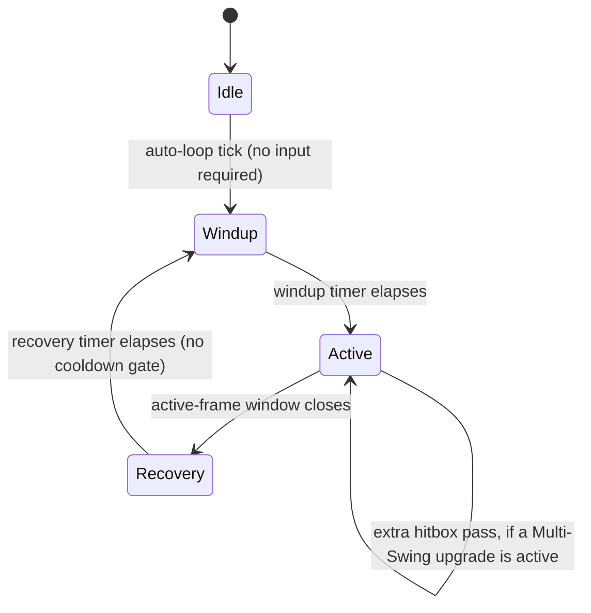

# Oversized — Implementation Guide

Companion to `architecture.md` (the "why") and `sprint-roadmap.md` (the "when"). This document is the "how" — concrete Godot patterns, folder structure, and the specific engineering decisions that make the horde-scale, dual-progression design in `architecture.md` actually run well.

Assumes Godot 4.7.x and GDScript as the default language, per the engine decision in `architecture.md`. Where a system is CPU-bound enough to justify it, a C# rewrite path is noted — Godot supports both in the same project.

---

## 1. Project Setup

- **Engine version**: pin to a specific Godot 4.7.x point release for the whole project (check the editor's Help menu / godotengine.org for the current patch — 4.7.1 and later maintenance releases exist and are safe upgrades within the 4.7 line). Re-pin deliberately when moving to 4.8, not automatically.
- **Renderer**: Forward+ is fine for 2D; it doesn't meaningfully cost more than the Mobile renderer for a top-down 2D game and keeps 3D options open if a later cosmetic effect wants it.
- **Physics tick**: leave default (60) initially; revisit only if the horde-performance work in Section 6 demands it.
- **Input map**: keep it deliberately small. Movement (WASD / left stick) is the only input most of the time, consistent with "abilities auto-cast." One active input is confirmed: a **dash/dodge**, built in Sprint 1.1. Design (settled 2026-09-28): **no cooldown** — the ninja fantasy is dashing whenever you want — implemented as a short fixed-distance velocity impulse with brief i-frames. It never touches the sword's swing state machine (movement and swing are decoupled systems), so dashing never interrupts or pauses the auto-swing; hit-and-run is the intended rhythm. Balance watch-item: unlimited mobility can trivialize "getting surrounded," the genre's core threat — if Phase 3's balance pass agrees, the fix is a subtle regulator (e.g., stamina pips), not a cooldown. (Megabonk's jump/slide is the genre precedent for free-movement skill expression.) Basic gamepad support is in scope from day one: every input action gets a gamepad binding when it's defined (left stick for movement, a face button for dash), and menus/choice screens lean on Godot's built-in `ui_*` gamepad navigation — with movement as the only real input, full gamepad play is nearly free and matters for Steam Deck–style handheld play. Full controller remapping remains a v1.0 non-goal (`architecture.md` Section 12).

## 2. Folder & Scene Structure

```
res://
  autoload/
    game_manager.gd
    event_bus.gd
    meta_progression.gd
    audio_bus.gd
  scenes/
    main_menu/
    run/
      run.tscn
      player/
        player.tscn
        player.gd
        sword.tscn
        sword.gd
      enemies/
        enemy_pool.tscn
        enemy_pool.gd
        boss/
      wave_director/
        wave_director.gd
    ui/
      hud/
      choice_screen/       # shared by both Sword and Ability picks
      meta_hub/
  resources/
    sword_upgrades/         # .tres files, one per upgrade
    universal_abilities/    # .tres files, one per ability
    progression/            # progression_curve.tres (Hero Level → XP/AP/unlocks)
    enemies/
    waves/
    bosses/
    cosmetics/
  scripts/
    resource_defs/          # the Resource class_name scripts (schemas)
  assets/
    sprites/
    audio/
    fonts/
```

Outside `res://`, keep an `art_source/` folder (next to the project, or `.gdignore`d) for `.aseprite`/source files so they never slow Godot's import step — export finished sheets into `res://assets/` (Section 16).

The `resources/` split matters: every piece of tunable content is a `.tres` file, not hardcoded in a script. That's what lets 24-30 sword upgrades and 25-35 abilities get built and rebalanced without touching combat code — see Section 3.

## 3. Data-Driven Content Pattern

Define each content type as a Resource subclass — a schema, not a scene. Example for a Sword Upgrade:

```gdscript
# scripts/resource_defs/sword_upgrade_def.gd
class_name SwordUpgradeDef
extends Resource

@export var id: StringName
@export var display_name: String
@export var icon: Texture2D
@export_enum("stat_mod", "on_hit_effect", "passive") var effect_type: String
@export var magnitude: float
@export var rarity_weight: float = 1.0
@export var stacks: bool = true
```

Each actual upgrade is then a `.tres` resource file built in the inspector (or generated), not a new script. A `ContentLoader` autoload scans `res://resources/sword_upgrades/` at startup and builds the in-memory pool:

```gdscript
# autoload/content_loader.gd (excerpt)
func load_sword_upgrades() -> Array[SwordUpgradeDef]:
    var out: Array[SwordUpgradeDef] = []
    for path in DirAccess.get_files_at("res://resources/sword_upgrades/"):
        if path.ends_with(".tres"):
            out.append(load("res://resources/sword_upgrades/" + path))
    return out
```

Do the same for `UniversalAbilityDef` (now carrying `kind` active/passive, `ap_cost`, `unlock_level`, `tags`, `max_rank` — fields per `architecture.md` Section 8), `EnemyDef`, `WaveDef`, `BossDef`, and `CosmeticItemDef` (fields per `architecture.md` Section 8). This is the single highest-leverage pattern in the whole project — nearly every sprint in `sprint-roadmap.md` that says "add content" means "add `.tres` files," not "write code."

Two content-adjacent systems live in this section because they're also "data, not code":

**Tag bitmask** (`architecture.md` §5.4): tags are an enum packed into one 64-bit int, so "does this hit carry Fire?" is a single bitwise AND — cheap enough to run on every hit in a horde game:

```gdscript
# scripts/combat/tags.gd
class_name Tags
extends RefCounted

enum Tag { FIRE, FROST, SHOCK, POISON, BLOOD, SLASH, ORBIT, BURST, PROJECTILE,
           SUMMON, ZONE, BURN, CHILL, SHOCKED, POISONED, BLEED, STUN,
           ON_HIT, ON_KILL, PERIODIC, CRIT, LIFESTEAL, KNOCKBACK, EXECUTE }

static func mask(tags: Array) -> int:
    var m := 0
    for t in tags: m |= (1 << t)
    return m

static func has(m: int, t: int) -> bool:
    return (m & (1 << t)) != 0
```

**Horde-safe statuses**: enemies live in flat arrays (Section 6), so statuses can't be child nodes. Store `status_mask: PackedInt32Array` (one entry per enemy slot) plus a per-status timer array; applying, ticking, and clearing a status is array math in the sim's step loop. Reactions subscribe to hit events through the `EventBus` and filter by mask — no ability needs to know another exists. Guardrails from `architecture.md` §5.4 (proc depth limit, internal cooldowns, proc coefficient, effect budget) are enforced in this layer.

**Progression curve**: Hero Level pacing, AP budgets, and roster unlocks live in one `ProgressionCurve` resource (`xp_required[]`, `ap_budget[]`, `slot_cap`, `roster_unlocks{level: ids}`) — retuning the whole feel of progression is a spreadsheet edit, never code. Evolutions are data too (`EvolutionDef { ability_id, requires_upgrade_id, result_id }`).

## 4. Autoload / Singleton Architecture

| Autoload | Responsibility |
|---|---|
| `GameManager` | Owns the top-level state machine (Menu → Run → Summary → Hub); scene transitions |
| `EventBus` | Global signal hub — `enemy_died`, `player_leveled_up`, `wave_cleared`, `boss_defeated`, etc. Combat, UI, and progression communicate through this, not direct references; synergy reactions also subscribe here and filter hit events by tag mask |
| `MetaProgression` | Hero Level, loadouts, Glory, unlocked abilities, unlocked cosmetics; owns save/load |
| `AudioBus` | Central SFX/music playback: volume routing, **voice limits per sound id**, minimum retrigger intervals, priority tiers, music ducking (Section 17) |
| `ContentLoader` | Scans and caches all `.tres` content on boot (Section 3), including the `ProgressionCurve` |

Keeping `RunState` (current wave, HP, active loadout) as a plain node inside the run scene rather than an autoload is deliberate — it should be trivially disposable when a run ends, with nothing lingering that needs manual resetting.

## 5. Player & Sword Combat

### 5.1 Sword swing state machine



"No cooldown" means Recovery flows straight back into Windup with nothing gating it — the sword is *always* mid-cycle. Sword Upgrades that affect attack pace do it by shortening Windup/Recovery, not by adding or removing a cooldown that doesn't exist. This keeps the sword feeling like a constant, always-on presence, in contrast to Universal Abilities, which genuinely do have individual cooldowns (Section 7).

### 5.2 Hitbox approach

**MVP (build this first):** an `Area2D` with a `CollisionPolygon2D` shaped like the swing arc, enabled only during the Active state, disabled otherwise. `body_entered` / `area_entered` signals feed the damage pipeline. This is fine up to a moderate enemy count and is the right starting point — don't pre-optimize before Sprint 0.1's stress test tells you where the ceiling actually is.

**Scaling approach (if the stress test shows it's needed):** replace the `Area2D` overlap check with a manual arc-sweep test against the spatial hash described in Section 6 — for each Active frame, query the hash for enemies within the sword's reach radius, then do a cheap angle check against the swing's current arc position. This avoids Godot's physics server entirely for the hit-detection step, which matters once enemy counts climb into the hundreds.

## 6. Enemy & Horde Performance — the section that matters most

This is the system `architecture.md`'s top technical risk points at. Get the pattern right early (Sprint 0.1) rather than retrofitting it after content is built on top of a slower approach.

**The problem, concretely**: Godot's physics server creates a collision-check pair for every pair of nearby shapes. A clump of a few hundred enemies converging on the player — which is exactly what this game wants to happen constantly — can generate tens of thousands of pairwise checks per frame if every enemy is a `CharacterBody2D` using `move_and_slide()`. That's a documented, common failure mode in the Godot community for exactly this genre, and it degrades gradually rather than failing loudly, which makes it easy to under-notice until it's a serious problem.

**The pattern to use instead:**

1. **Object pooling.** Pre-instantiate a pool of enemy nodes at scene load (sized to comfortably exceed the intended concurrent-alive cap). Activate/deactivate (`visible`, `set_process`, reset stats) rather than `instantiate()` / `queue_free()` during combat. Instancing cost is a real, avoidable frame-time spike at this scale.
2. **Manual position updates, not physics bodies.** Enemies don't need `CharacterBody2D` or `move_and_slide()` to chase the player — a flat array of positions/velocities updated directly in `_process` (or `_physics_process`) is both faster and gives full control over movement behavior (flocking, avoidance, formation) without the physics server's overhead.
3. **A uniform-grid spatial hash for neighbor queries.** Anything that needs "what enemies are near point X" (the sword's hit detection, enemy-vs-enemy separation, AoE ability effects) should query a spatial hash rebuilt once per frame from the position array — not `Area2D` overlap signals per enemy. This is the same category of solution community GDExtension plugins (built for bullet-hell-scale projectile counts) use internally; you don't need their exact plugin, but the underlying technique — flat data, spatial partitioning, no per-entity physics body — is the transferable lesson.
4. **Rendering via `MultiMeshInstance2D`, decoupled from logic.** Keep the visual layer (a single `MultiMeshInstance2D` per enemy archetype, transforms updated from the position array each frame) completely separate from the logic array. This means the renderer never cares how enemy state is computed, and the logic array never cares how it's drawn — useful for later work like adding hit-flash or death-animation without touching movement code.

**Suggested performance targets**: 300-500+ concurrent enemies at a stable 60 fps as the primary target hardware's bar, with a lower-spec fallback tier (reduced concurrent cap, simplified particle/VFX budget) rather than one hardcoded number everywhere.

### Wave Director

Reads `WaveDef` resources and drives spawning against a budget curve (spawns-per-second that increases with wave number, capped by the concurrent-alive limit from the pool). "Infinite" enemies means this curve has no upper bound on wave number, not that the pool itself is unbounded — see `architecture.md` Section 9.

## 7. Auto-Cast Universal Abilities

Each active Universal Ability is a small object holding its own cooldown `Timer` (or a manually-ticked float, whichever profiles better at scale), auto-firing when it reaches zero — no player input path exists for these at all. Two worked examples:

- **Orbiting Blades**: N blade nodes rotating around the player at a fixed radius, continuous overlap damage on contact (no cooldown timer needed — it's a persistent hazard rather than a periodic burst). Rank-ups add blades or increase radius/damage.
- **Ground Slam Shockwave**: cooldown timer counts down; on expiry, spawn a radial damage pulse at the player's position (a quick expanding `Area2D` or a spatial-hash radius query, consistent with Section 6) and reset the timer. Rank-ups reduce cooldown or increase radius/damage.

Both feed damage through the same central pipeline the sword uses (`architecture.md` Section 7), so crit rolls, elemental interactions, and on-hit effects (lifesteal, etc.) apply uniformly regardless of source. Each active Universal Ability is one entry from the player's **equipped loadout** (`architecture.md` §5.2): actives must be brought online by an in-run level-up card (except the chosen opening ability), while passives apply from run start. Ability definitions carry `kind` (active/passive), `ap_cost`, `unlock_level`, `tags`, and `max_rank` — the loadout/equip rules live in the hub (Sprint 2.2) and the synergy layer rides on the tags (Section 3).

## 8. Boss Implementation

Each `BossDef` drives a state machine of telegraphed attack patterns, transitioning on HP-percentage thresholds (phase 2 at 66%, phase 3 at 33%, for example). Telegraph-then-execute is worth being disciplined about even in an auto-cast game — the *player's* damage output is automatic, but boss fights are one of the few places where the player's positioning/dodging genuinely matters, and that only works if attacks are readable.

For "Champion" modifier scaling (reusing bosses past the hand-authored roster, per `architecture.md` Section 9): design `BossDef` with a `champion_modifier_slots` field from day one — even if it's unused until later — so a boss can later be instantiated with "+1 phase, +20% attack speed, +fire damage" without a rewrite of the base boss logic.

## 9. Progression Screens

Both the Sword Upgrade pick and the Universal Ability pick should be **one shared UI component** with two different data sources — not two separate screens. The component takes an array of candidate definitions (already pre-filtered: run-local pool for sword picks, the player's **equipped loadout** for ability picks), presents 2-4 as cards, and returns the chosen one. This is worth building once, well, in Sprint 1.1 rather than twice. (The 1.1 version already supports reroll/banish as data — the buttons appear when the per-run allotment exists, Sprint 2.4.)

XP/leveling: kills drop XP pickups (or grant XP directly — pickups add a small positioning/routing element to the moment-to-moment movement, which is cheap value for a purely-movement-input game). Level thresholds follow a standard increasing curve; exact tuning is a Phase 3 balance concern, not a Phase 1 architecture concern.

## 10. Meta-Progression & Save System

| Data | Persists? | Where |
|---|---|---|
| Character Level, current HP/XP, active loadout ranks, active Sword Upgrades | No — resets every run | `RunState` node, in-memory only |
| Hero Level, Hero XP, unlocked abilities, saved loadouts | Yes | `MetaProgression` save file |
| Glory balance | Yes | `MetaProgression` save file |
| Unlocked/equipped cosmetics | Yes | `MetaProgression` save file |
| Best wave reached, run stats/achievements | Yes | `MetaProgression` save file |

**Save format**: a single JSON file via `FileAccess`, with an explicit `"schema_version"` field from the very first save ever written. This costs nothing up front and avoids a genuinely painful migration problem later — every comparable live-updated game eventually adds new save fields, and a version field is what makes that safe.

## 11. Cosmetics Implementation

`CosmeticItemDef` has no stat fields, full stop (matches the hard rule in `architecture.md` Section 6) — this is worth enforcing at the schema level, not just as a convention, so it's structurally impossible for a future content addition to sneak power into a skin. Equip slots: hero skin, sword skin, trail/particle effect, victory pose. Applying a cosmetic swaps a sprite/texture reference or attaches a particle-effect node — it should never touch the stats/combat side of the player node.

Given the sword *is* the visual hook, sword skins are worth treating as the flagship cosmetic category — a progression of increasingly absurd sword designs (each still readable at speed, still silhouette-clear) is likely to be the single most screenshot-and-clip-worthy system in the game.

## 12. UI/UX Notes

- **HUD**: HP, wave number/timer, XP bar, currently-equipped Sword Upgrades and Universal Abilities as small icon rows (players will want to check their build mid-run).
- **Choice screens**: pause the run entirely while a Sword Upgrade or Universal Ability choice is open (both are already using the shared component from Section 9).
- **Meta Hub**: the between-runs screen where the player manages their **loadout** (equip owned abilities within the AP budget — the full AP screen lands in Sprint 2.2; the 1.3 version can be a stub) and Glory buys cosmetics. Keep power (loadout) and looks (Glory) visually separated so the two never feel like they're competing for the same button.

## 13. Debug & Tooling

Build a debug console early (Sprint 1.x, not held until Phase 3) with at minimum:

- `spawn_wave <n>` — jump straight to a given wave for testing late-game balance without a 20-minute run-up
- `grant_xp <amount>` / `grant_currency <runeshards|glory> <amount>` — test progression screens and the meta hub without grinding
- `god_mode` toggle
- `stress_test <enemy_count>` — spawn a raw count of enemies with no AI, purely to profile the horde-rendering pipeline in isolation

This is disproportionately valuable for a numbers-heavy, constantly-rebalanced genre — every hour spent here saves several hours of manual playtesting later.

## 14. Testing Strategy

- **Playtesting cadence**: aim for a playable build every sprint from Phase 1 onward, even if rough — this genre lives or dies on feel, which can't be evaluated from code review.
- **Long-session smoke test**: an automated or scripted bot that just holds "move toward nearest enemy" for an extended session is enough to catch memory leaks, pool exhaustion, and crash-after-N-minutes bugs that short manual playtests won't surface.
- **Performance profiling checklist** (run this whenever the horde system changes): frame time at 0 / 100 / 300 / 500 concurrent enemies; physics server collision-pair count (should stay near zero if Section 6's approach is followed correctly); draw call count from the MultiMesh layer.

## 15. Steamworks Integration (later phase)

Not needed until `sprint-roadmap.md`'s Demo Prep phase: achievements, cloud saves, and rich presence via GodotSteam (the community-maintained Steamworks binding for Godot) are the standard, low-risk path — this is a well-trodden integration for Godot 2D games and shouldn't be started earlier than it's needed.

## 16. Art Pipeline

Merged from the systems deep-dive (2026-09-29). Decisions already made: **pixel art, self-made plus licensed/CC0 packs, no commissions** (`architecture.md` §13) — this section is how that stays tractable.

### 16.1 The honest math first

Rough **unmeasured** planning estimate if everything were made from scratch: hero animations 20–30 h, 15–20 base enemies at 2–3 h each (40–60 h), 6–8 bosses at 10–20 h each (60–160 h), ~60 icons at 0.5–1 h (30–60 h), a parameterized VFX kit (30–50 h), a UI kit (30–40 h), 2–3 tilesets (30–75 h), 8–12 skin sets (25–60 h) — **~265–535 h total**. These are guesses, not data: time the first three enemies in Sprint 2.3 and rescale. The mitigation levers, in order of leverage: pack/CC0 sourcing for high-volume assets, the free multipliers below, passives as icon-only roster entries, and cutting per the roadmap's ordered cut list.

### 16.2 Sourcing rule

- **Self-make** the assets that *are* the game's identity: the hero, the sword, sword skins, bosses — in deliberately simple, readable pixel art.
- **Buy/license/generate** the high-volume, low-identity assets: tilesets, UI kit, most icons, generic enemy bases. Check every license for commercial use, redistribution inside a shipped game, and credit requirements; keep the license alongside each asset in the tracker (16.5). CC0 packs (Kenney's are the well-known example) carry the least risk — verify each pack rather than assuming.
- **Unify mismatched sources** rather than hunting for a perfect single-artist set: one shared palette, one palette-remap shader applied globally, consistent outline treatment. That's how a mixed asset base reads as one style.
- Commissions are the *fallback*, not the plan — only revisit if the Sprint 2.3 timing exercise says art is the bottleneck anyway (`architecture.md` §13, decision 6).

### 16.3 Art direction constraints (decide once, early)

- **Base resolution: 640×360 pixel art (recommended default).** It integer-scales to 1080p (3×), 1440p (4×), 4K (6×) with no blurry non-integer scaling, and letterboxes cleanly on Steam Deck. Decide by end of Phase 1 — it touches every sprite ever made.
- **Size guide**: hero ~32–48 px tall; standard enemies 16–32 px; bosses 64–128 px; the sword deliberately **~2–3× the hero's height** — the gag has to read at a glance.
- **Readability at density is the whole ballgame.** Three rules:
  1. **Hostile color reserved.** Enemy projectiles and boss telegraphs use one hue family (e.g., red-magenta) that player effects *never* use.
  2. **Tag→color language.** Fire orange, Frost cyan, Shock yellow, Poison green, Blood crimson-dark. Players learn to read a build from the screen (`architecture.md` §5.4).
  3. **Dark, desaturated backgrounds** so enemies and effects pop; palette limited to ~16–32 colors overall.
- **The sword swing is procedural.** One sword sprite rotated by code plus 3–4 smear frames — not a hand-animated swing per skin. Every sword skin then costs one sprite plus an optional trail. (The prototype already draws the blade procedurally; this scales that to sprites.)
- **Free multipliers**: hit-flash shader (all enemies — the prototype's flash proves the pattern), palette-swap shader (each enemy base ×2–3 recolored variants), a single pooled tinted "poof" for all deaths.
- **Enemy animation inside `MultiMeshInstance2D`**: drive the animation frame from per-instance custom data read by the shader, not per-instance `AnimatedSprite2D` nodes. This is what keeps animated hordes cheap.

### 16.4 VFX kit

Build ~8–10 parameterized base effects — slash arc, burst ring, projectile, orbit trail, aura, impact spark, shockwave, status overlay — each taking a **color and scale**, colored from the tag→color map. One kit then covers 50+ abilities and upgrades (the prototype's `BurstRing` is the first kit member). Bespoke VFX is reserved for bosses and evolutions.

### 16.5 Pipeline mechanics

- **Import settings for pixel art**: Nearest filtering, no mipmaps — via import presets, so nothing is set by hand per asset.
- **Naming**: `snake_case`, category-first — `enemies/goblin/goblin_walk_sheet.png`, `icons/abilities/ground_slam.png`.
- **Four asset stages**, and every asset is in exactly one at a time: **Greybox** (colored shape at final size with correct footprint) → **Placeholder** (rough sprite, all animation states) → **Final** (approved) → **Locked** (set at **art lock**, end of Sprint 3.3).
- **One asset tracker** (CSV or sheet): `id, category, stage, source (self/pack/commission), license, notes`. It doubles as the license audit trail Steam paperwork will eventually want.
- **Rule: gameplay before art.** Phase 2 runs entirely on greybox/placeholder assets so systems work never blocks on art; the real art pass concentrates in Phase 3, with pack sourcing done early in parallel.

## 17. Audio Design

Merged from the systems deep-dive (2026-09-29). Same sourcing stance as art: self-generated and licensed/CC0, no commissions by default.

**Buses**: Master → Music, SFX, UI (each with a player-facing slider), plus a dedicated SFX sub-bus for the constant swing/hit sounds so they can be mixed and compressed separately. All live in the `AudioBus` autoload (Section 4).

**The constant-sound problem.** In a horde game, hits and kills fire constantly; unmanaged, the mix turns to mud and the sword swing — heard hundreds of times a run — becomes fatiguing. Mitigations, all in `AudioBus`:

- **Voice limits per sound id** (e.g., hit ≤ 6 concurrent, kill ≤ 4).
- **Minimum retrigger interval** (~30–50 ms) per id.
- **Priority tiers**: boss/player/level-up sounds always play; ambient hit and kill sounds drop first.
- **Pitch and sample variation** via `AudioStreamRandomizer` (3–4 variants per sound, small random pitch) to avoid machine-gun repetition.
- Keep the swing sound short and low in the mix.
- **Duck the music** when a choice screen opens or a boss telegraph fires (a bus-volume tween is enough).

**SFX budget (demo tier, ~60–80 sounds)**: sword swing (variants), hit (light/heavy/crit), kill (soft, rate-limited), XP pickup (pitch rising with rapid pickups — very satisfying), player hurt, level-up jingle, wave-clear stinger, choice-screen open/select/reroll/banish, ability delivery types (burst, orbit hum loop, projectile, summon), subtle status-apply cues, boss warning/telegraph/death, UI hover/click/buy/error.

**Music (demo tier, 3–4 tracks)**: menu/hub, run, boss, plus one more for EA. Make the run track **layered**: a base stem always playing, intensity stems fading in with wave number or enemy density. Godot's interactive/synchronized stream types (`AudioStreamInteractive`, `AudioStreamSynchronized`) are built for this — **verify the exact API in the 4.7 docs before committing** (`architecture.md` §13, decision 7). When licensing music, confirm stems and clean loop points are part of the deliverable.

**Sourcing**: generate raw SFX with an sfxr-family tool, then layer and edit in a DAW; supplement with licensed libraries (same license discipline as art, tracked the same way).

## 18. Appendix: Optional Accelerators

Worth knowing about, not required to start: the Godot community has produced GDExtension (C++) plugins purpose-built for rendering very large counts of bullets/particles efficiently via `MultiMeshInstance2D` under the hood. These solve a narrower version of the same problem Section 6 describes for enemies. They're worth evaluating *after* the custom spatial-hash approach is working and profiled — as a possible swap-in for the rendering layer specifically — rather than as a day-one dependency, since pulling in a GDExtension adds a build-toolchain requirement the project doesn't otherwise need.
