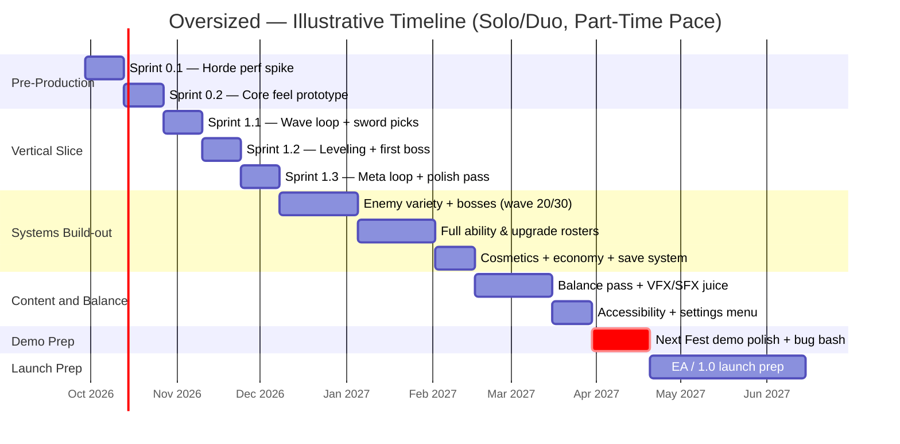

# Oversized — Sprint Roadmap

Companion to `architecture.md` (the systems) and `implementation-guide.md` (the patterns). This document is the sequencing: what to build in what order, roughly how long each phase takes, and how that lines up against real Steam Next Fest dates.

---

## 1. How to Use This Roadmap

Two things make this different from a fixed-date project plan, deliberately:

1. **Phases are scope-gated, not date-gated.** Each phase is defined by "what's true when it's done," not "what calendar week it ends." Dates below are *illustrations* of one reasonable pace, not commitments.
2. **Every phase gets two duration estimates**, because team size and available hours change everything about pacing and weren't specified up front:
   - **Solo/duo, part-time** — roughly 15-20 focused hours a week (evenings/weekends alongside other commitments)
   - **Full-time, solo or small team** — roughly 40+ hours a week, whether that's one person full-time or a small team where "full-time" means more parallel work rather than more speed per task

If neither of those matches your actual situation, the honest fix is to tell me your real team size and weekly hours and I'll recompute the calendar dates directly — the sprint *contents* below stay valid either way; only the calendar math changes.

## 2. Phase Overview & Dual-Track Estimates

| Phase | Scope goal | Solo/duo, part-time | Full-time (solo or small team) |
|---|---|---|---|
| 0 — Pre-Production | De-risk horde performance; prove the core swing feels good | 4 weeks | 1.5-2 weeks |
| 1 — Vertical Slice | One complete 10-wave run, one boss, both pick-screens, minimal meta loop | 6 weeks | 2-3 weeks |
| 2 — Systems Build-out | Every core system at MVP breadth (full content *types*, not full content *volume*) | 10 weeks | 4 weeks |
| 3 — Content & Balance | Full v1.0 content budget, tuned, with juice/VFX/SFX and accessibility basics | 6 weeks | 3 weeks |
| 4 — Demo Prep | Polished representative slice, Steam page, trailer, bug bash | 3 weeks | 2 weeks |
| **Subtotal — demo-ready** | | **~29 weeks (~6.5 months)** | **~12.5-14 weeks (~3 months)** |
| 5 — EA / 1.0 Launch Prep | Remaining content, marketing basics, launch checklist | 6-10 weeks | 3-4 weeks |
| **Total to launch-ready** | | **~35-39 weeks (~8-9 months)** | **~15.5-18.5 weeks (~4 months)** |

## 3. Illustrative Timeline

Starting from today (September 28, 2026), at the **solo/duo part-time** pace — the full-time track compresses the same phase order, it just doesn't need its own separate chart.

## 4. Steam Next Fest Targeting

Steam Next Fest runs three times a year; the next two editions and their real deadlines:

| Edition | Registration deadline | Demo build due (press preview) | Fest dates | Solo/duo part-time? | Full-time? |
|---|---|---|---|---|---|
| **February 2027** | Jan 10, 2027 (~15 weeks out) | ~Jan 25, 2027 (~17 weeks out) | Feb 22 – Mar 1, 2027 | **No** — Systems Build-out is likely still in progress at this pace | **Yes** — demo-ready with roughly 4-5 weeks of buffer |
| **June 2027** | Apr 25, 2027 (~30 weeks out) | Demo must be live by fest open | June 14 – 21, 2027 | **Yes** — demo-ready around mid-April, ~10-11 weeks of runway for playtesting before registration closes | **Yes** — very comfortable |

**Recommendation**: at a part-time pace, target **June 2027** — trying to force a February 2027 submission would mean cutting Systems Build-out or Content & Balance short, and a rough public demo does more damage to a Steam wishlist page than a delayed one. At a full-time pace, **February 2027 is genuinely reachable** and worth the more aggressive schedule, since a small team's extra bandwidth is better spent on *more* demo content/polish in that window than on hitting an even earlier date.

Submit for Steam's store-page/demo review a full 5-7 business days before whichever deadline applies — review turnaround isn't instant, and it's the one dependency in this whole roadmap that isn't under direct control.

## 5. Phase 0 — Pre-Production (Risk-First Prototyping)

**Goal**: prove the two scariest unknowns before a single hour goes into content — can the engine actually render/simulate the enemy density this game needs, and does swinging a huge sword feel good at all.

### Sprint 0.1 — Horde performance spike
- **Tasks**: engine/project setup per `implementation-guide.md` Section 1-2; build the object-pooling + manual-position + spatial-hash pattern from Section 6 in isolation (no gameplay, just dots moving toward a point); add the `stress_test <n>` debug command early and use it to find the real concurrent-enemy ceiling on target hardware; render via `MultiMeshInstance2D` from the start, not bolted on after.
- **Definition of Done**: a hard number for "how many concurrent enemies at 60fps," measured, not guessed. If the number is uncomfortably low, this is the sprint to solve it — not a problem to discover in Phase 3.
- **This is a go/no-go checkpoint.** If it's not solved by the end of this sprint, the right move is to lower the concurrent-enemy target and move on, not to keep open-ended debugging — see the risk register in Section 10.

### Sprint 0.2 — Core feel prototype
- **Tasks**: player movement, the sword swing state machine (`implementation-guide.md` Section 5.1), one enemy type, basic damage numbers, screen-shake/hit-stop juice on the swing; gamepad bindings for every input action added from here on (left stick movement, dash button) so the prototype is gamepad-playable immediately. No meta-systems, no progression screens yet.
- **Definition of Done**: "is swinging a big sword at a crowd of guys fun for five straight minutes with zero other systems in place?" If the answer's no, everything downstream is at risk regardless of how good the systems built on top of it are — worth being honest here before investing further.

## 6. Phase 1 — Vertical Slice

**Goal**: one complete run is playable start to finish, even with placeholder art and a small content set.

### Sprint 1.1 — Wave loop + Sword Upgrade picks
- Wave Director reading `WaveDef` resources; wave-clear condition (timer-based, per `architecture.md` Section 4); the shared choice-screen UI component (`implementation-guide.md` Section 9); 5-8 real Sword Upgrades.

### Sprint 1.2 — Leveling + Universal Ability picks + first boss
- XP/leveling; 5-8 real Universal Abilities using the same shared choice-screen component; the first hand-authored boss at wave 10 with a telegraphed attack pattern (`implementation-guide.md` Section 8).

### Sprint 1.3 — Meta loop + run-loop polish
- Death → Run Summary → Runeshards/Glory awarded → minimal Meta Hub (even just "spend Runeshards to unlock 1-2 more abilities") → back to menu. Basic save/load. Restart flow polish.

**Vertical Slice Definition of Done**: one hero, sword with base swing plus at least 5 upgrades taken across a run, at least 5 Universal Abilities available, waves 1-10 fully playable, one unique boss at wave 10, a working death → summary → currency → hub → menu loop, playable with a gamepad (movement, dash, choice-screen navigation), no crashes across a 15-minute session.

## 7. Phase 2 — Systems Build-out

**Goal**: every core system exists at MVP breadth — this phase is about *types*, not yet full *volume* (that's Phase 3).

- **Sprint(s)**: additional enemy types and spawn-composition variety; bosses at waves 20 and 30; the full data-driven pipeline for adding new Sword Upgrades and Universal Abilities without new code (`implementation-guide.md` Section 3); cosmetics system with 2-3 sets; Runeshards/Glory economy tuning pass #1; save-system versioning (`implementation-guide.md` Section 10); settings menu skeleton.

**Definition of Done**: the full roster of *systems* is functional in-game even if numbers are unbalanced and art is placeholder — save/load works, the meta hub spends both currencies on something real, cosmetics equip and visibly change the character/sword.

## 8. Phase 3 — Content & Balance

**Goal**: hit the v1.0 content budget from `architecture.md` Section 6, tuned and polished.

- Fill out Sword Upgrades and Universal Abilities to the 24-30 / 25-35 targets; fill out enemy types toward the 15-20 target; hand-author remaining bosses (waves 40, 50, and beyond per the target in `architecture.md`); a dedicated balance pass (this is the phase where the debug console from `implementation-guide.md` Section 13 pays for itself repeatedly); VFX/SFX juice pass; accessibility basics — rebindable keys, colorblind-safe damage numbers and boss telegraphs, audio sliders.

**Definition of Done**: the full content budget is in-game and tuned (not just present), settings/accessibility basics are complete, the game is enjoyable across a full run rather than just its first few waves.

## 9. Phase 4 — Demo Prep & Steam Next Fest Submission

**Goal**: a polished, representative slice ready for public hands, plus everything Steam requires around it.

- **Tasks**: select and polish a representative slice (suggest waves 1 through ~20, including one or two bosses — enough to show the full loop, including at least one Sword-Upgrade-pool refresh and a Mastery Rank glimpse, without needing the full content budget live); Steam store page (capsule art, description, screenshots); trailer; bug bash pass; external playtests with feedback triaged; submit for Steam review 5-7 business days ahead of the relevant Next Fest deadline from Section 4.

**Demo-ready Definition of Done**: the representative slice is free of known crash/softlock bugs, runs at target performance on minimum-spec hardware, the Steam page is live with capsule art and a trailer, and at least a few external playtesters have played it with their feedback reviewed.

## 10. Phase 5 — Early Access / 1.0 Launch Prep

**Goal**: get from "demo people liked" to "shippable product."

- Incorporate Next Fest feedback; decide Early Access vs. direct 1.0 (Early Access is the norm for this genre — it builds wishlists and reviews before the number that matters most, and several of the precedent titles in `architecture.md` used exactly this path); finish any remaining content budget items; pricing — genre precedent (Brotato, Vampire Survivors, Megabonk) clusters around $4.99-$6.99 for a premium one-time purchase, which is a reasonable anchor rather than a rule; basic marketing checklist (press list, key distribution, launch-day community presence); final launch-day checklist (build validation across target hardware, store page final review, day-one patch readiness).

## 11. Phase 6 — Post-Launch (sketch)

Beyond this roadmap's primary horizon, but worth naming so Phase 5 doesn't treat launch as a finish line: a content-update cadence (new bosses, new Sword Upgrades/Universal Abilities, seasonal cosmetic sets) is standard for the genre and is realistically what turns an initial launch into a long-tail seller — Vampire Survivors' continued DLC cadence and Brotato's post-launch character additions are the reference points here.

## 12. Risk Register (schedule-specific)

| Risk | Likely schedule impact | Mitigation |
|---|---|---|
| Horde-performance spike (Sprint 0.1) takes longer than one sprint to resolve | Delays everything downstream, since every later phase assumes it's solved | Treat Sprint 0.1 as a hard go/no-go checkpoint (Section 5): if unsolved by the end of it, lower the concurrent-enemy target and proceed, rather than let it run open-ended |
| Balance/tuning iteration takes longer than the Phase 3 estimate | Eats into Demo Prep, risks a rushed public demo | Build the debug console in Phase 1, not Phase 3 (`implementation-guide.md` Section 13), so tuning iteration starts early rather than being compressed at the end |
| Content production (art/animation for 24-30 upgrades + 25-35 abilities) underestimated | Phase 2-3 slip | Reuse a small, tintable/scalable VFX "kit" across most abilities rather than bespoke art per ability; reserve bespoke art budget for sword skins specifically, since those are the flagship visual hook |
| Holiday period or burnout dip (solo/small team, part-time track lands across Nov-Jan) | 2-4 week slip | Not built into the estimates above as a separate line — if targeting the February 2027 Next Fest specifically, add an explicit buffer sprint after Phase 2 rather than assuming continuous output through the holidays |
| Steam review turnaround for the demo build | Could miss a hard Next Fest deadline by a few days | Submit 5-7 business days ahead of the deadline, not on it (Section 4) |

## 13. Definition of Done — Quick Reference

- **Vertical Slice**: Section 6's DoD.
- **Systems Build-out**: Section 7's DoD.
- **Content & Balance**: Section 8's DoD.
- **Demo-ready**: Section 9's DoD.

## 14. Adjusting This Roadmap

The phase *contents* above (what gets built, in what order) hold regardless of team size — that sequencing is driven by dependencies (you can't balance content that doesn't exist yet; you can't demo a game that crashes) more than by who's building it. What changes with a different team size or weekly-hours reality is purely the calendar math in Sections 2-4. Share the real numbers whenever you have them and this recalculates directly into actual target dates rather than the two illustrative tracks used here.
